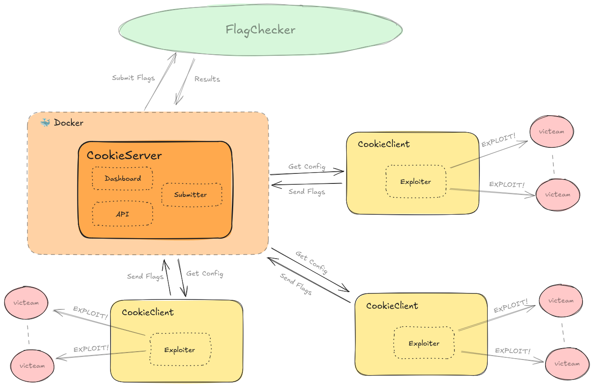

<div align="center" style="margin-bottom: 20px">
  
</div>


# CookieFarm

**CookieFarm** is a Attack/Defense CTF framework inspired by DestructiveFarm, developed by the Italian team **ByteTheCookie**. What sets CookieFarm apart is its hybrid Go+Python architecture and "zero distraction" approach: **Your only task: write the exploit logic!**

The system automatically handles exploit distribution, flag submission, and result monitoring, allowing you to focus exclusively on writing effective exploits.

---

## 📁 Repository Structure

- [**`client/`**](./client/) – Directory dedicated to client logic (exploiting and submitting flag to the server)
- [**`server/`**](./server/) – Directory dedicated to server logic (handling exploit distribution, flag submission, and result monitoring)

---

## 📐 Architecture

<div align="center" style="margin-bottom: 20px">
  
</div>

---

## ▶️ Usage Guide

### 💻 Starting the Server

To start the server:

1. Navigate to the `server/` directory:

   ```bash
   cd server/
   ```

2. Create a `.env` file in the server directory to configure the environment settings:

    ```bash
      # Server configuration
      DEBUG=false                   # Enable debug mode for verbose logging
      SERVER_PASSWORD=SuperSecret  # Set a strong password for authentication
      CONFIG_FROM_FILE=config.yml  # Set if the server takes the config from config.yml in the filesystem; otherwise, do not set the variable
      SERVER_PORT=8080            # Define the port the server will listen on
    ```

  > ⚠️ For production environments, set `DEBUG=false` and use a strong, unique password

3. Launch the server using Docker Compose:

   ```bash
   docker compose up
   ```


### 💻 Running the Client and Exploit

1. Navigate to the `client/` directory:

   ```bash
   cd client/
   ```

2. Copy the exploit template (`exploit.py`) to the `exploits/` folder with a new name:

   ```bash
   cp ./exploits/exploit.py ./exploits/your_exploit.py
   ```

   > 🔧 *Edit `your_exploit.py` to implement your custom exploit logic.*

3. Run the exploit manager with the following command:

   ```bash
   cookieclient -e ./exploits/your_exploit.py -b http://10.10.23.1:8080 -p Str0ng_p4ssw0rd
   ```

   * `-e`: path to your exploit script
   * `-b`: target server base URL
   * `-p`: password for authentication

🎉 **Enjoy your exploitation session!**

---

### 🔹 Prerequisites

Ensure you have installed:
1. **Python 3+**
2. **Docker**

## 🤝 Contributing

Contributions, suggestions, and bug reports are always welcome! Check out [CONTRIBUTING.md](CONTRIBUTING.md) for more details on how to contribute to the project.

## 📝 Notes

CookieFarm was designed with particular attention to user experience during high-pressure CTFs. Our goal is to eliminate every distraction and allow you to focus on what really matters: writing effective exploits.

**Created with ❤️ by ByteTheCookie**
