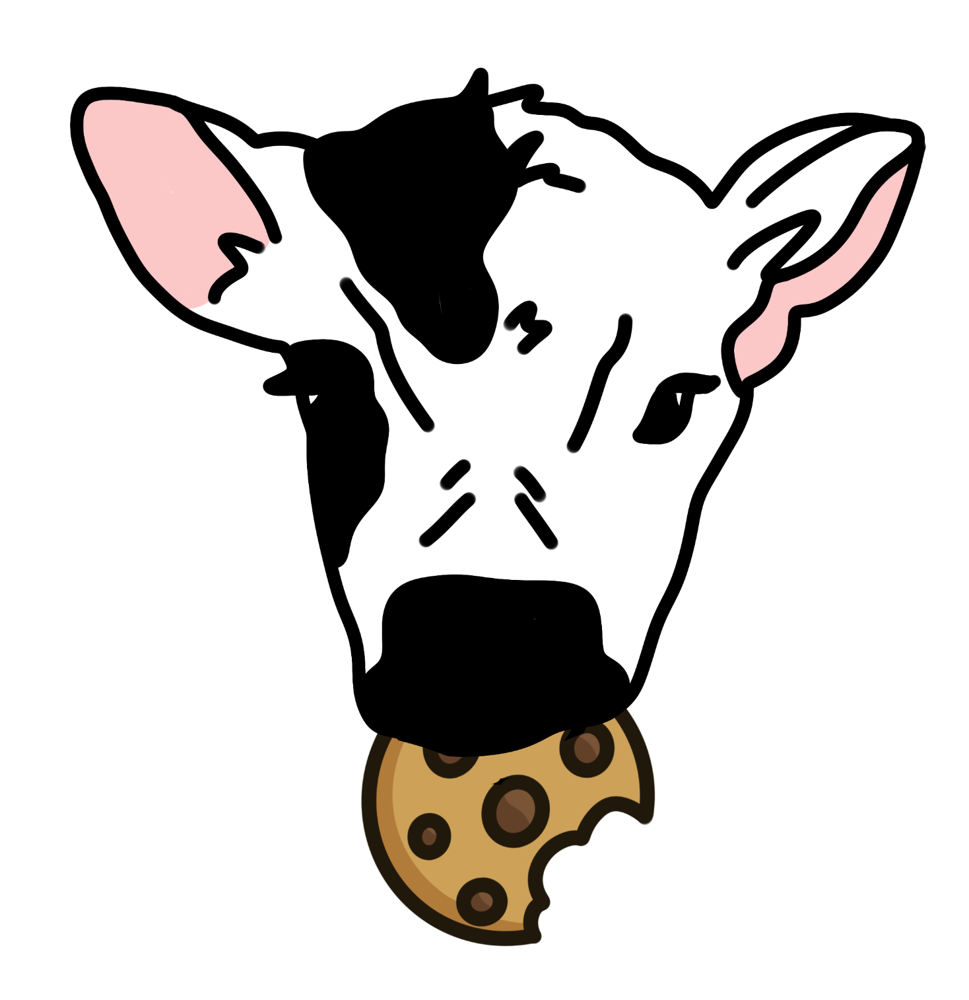
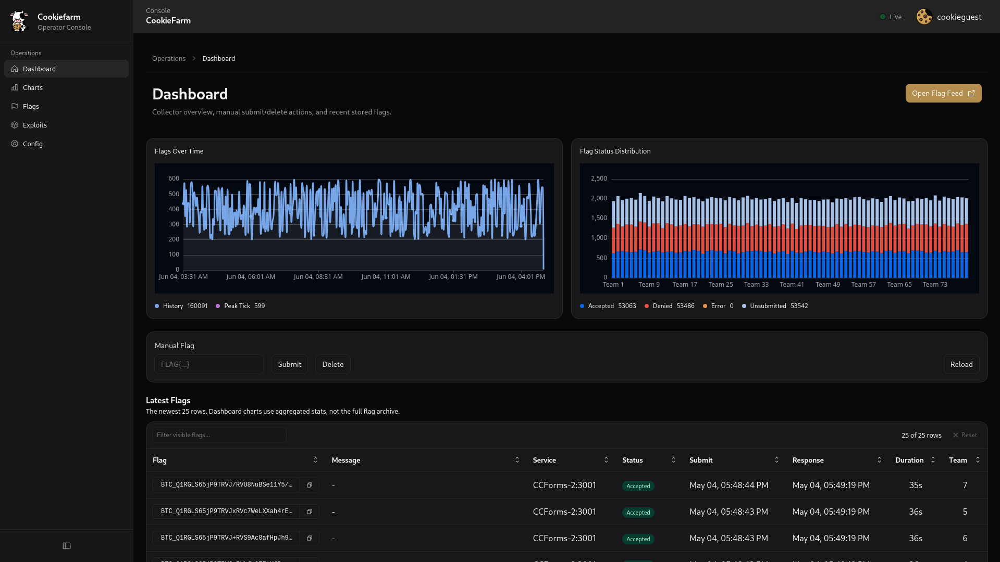
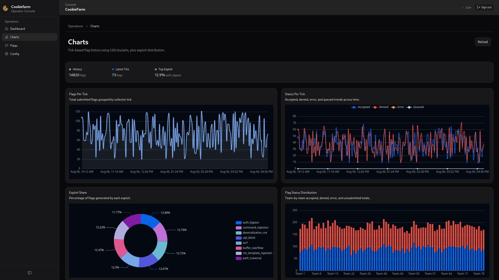
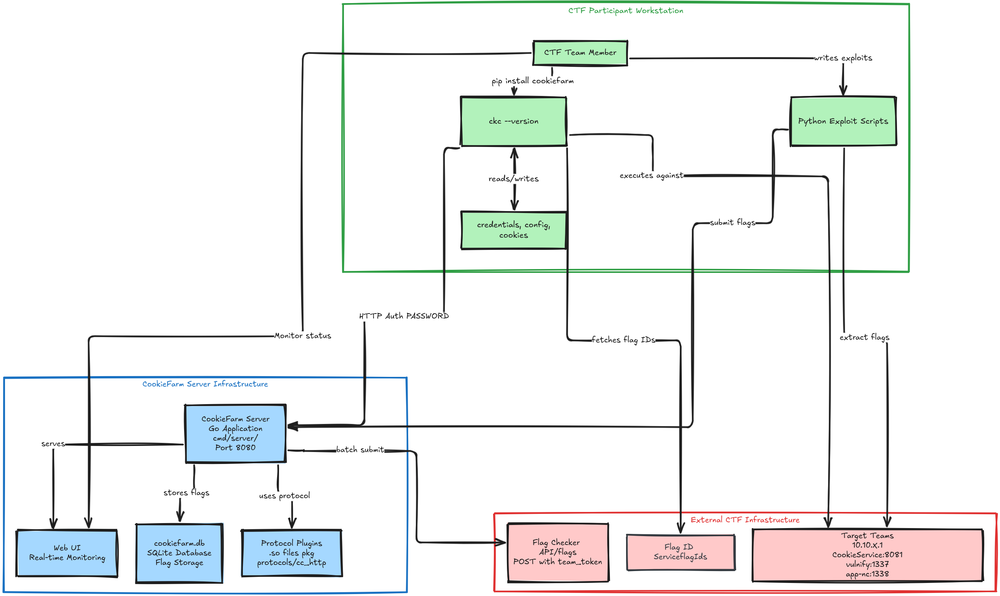
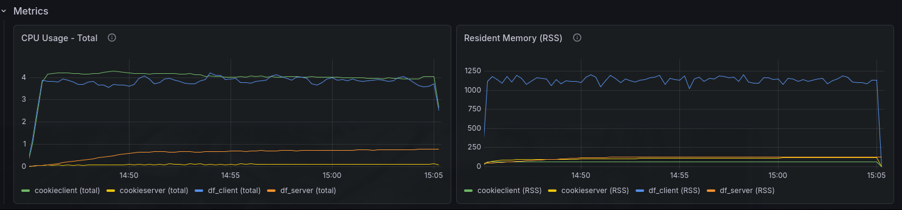

<div align="center">
  
</div>

<p align="center">
  
  
  
  
</p>

**CookieFarm** is an [*Attack/Defense CTF*](https://en.wikipedia.org/wiki/Capture_the_flag_(cybersecurity)) framework inspired by DestructiveFarm, developed by the Italian team **ByteTheCookies**.
Its strength lies in a hybrid **Go + Python** architecture and a **zero-distraction philosophy**:
> 🎯 *Your only task is to write the exploit!*

CookieFarm automates exploit distribution, flag submission, and result monitoring — allowing you to focus entirely on building powerful exploits.




---

# ⚙️ Installation

## Server

```bash
bash -c "$(curl -sSL cookiefarm.bytethecookies.org/install.sh)"
```

> [!NOTE]
> If you need a manual setup check out the official [docs](https://cookiefarm.bytethecookies.org/docs/server/overview)

## Client

```
pip install cookiefarm
```

>[!TIP]
> Check if all is good with `ckc --version`

---

## ⚡️ Getting Started

### Starting the Server

#### Automatic Setup

if you have alredy installed using the script do simple:

```docker compose up --build -d```


#### Manual Setup

1. Clone the repository and navigate to the server directory:
```bash
git clone https://github.com/ByteTheCookies/CookieFarm.git
cd CookieFarm
```

2. Create an `.env` file in the server directory to configure the environment settings:

```env
# Server configuration
DEBUG=false                   # Enable debug mode for verbose logging
PASSWORD=SuperSecret  # Set a strong password for authentication
CONFIG_FILE=true  # Set if the server takes the config from config.yml in the filesystem; otherwise, do not set the variable
PORT=8080            # Define the port the server will listen on
```

  > [!WARNING]
  > For production environments, set `DEBUG=false` and use a strong, unique password

3. Create the config.yml file in the server directory to configure the services and teams:

```yaml
configured: true

server:
  url_flag_checker: "<ip_flagchecker>:<port_flagchecker>"
  team_token: "<your_team_token>"
  submit_flag_checker_time: 120
  max_flag_batch_size: 1000
  protocol: "cc_http"
  tick_time: 120
  start_time: <start_time>
  end_time: <end_time>
  flag_ttl: 5 # in ticks (if the ttl is 0, the flag will never expire)

shared:
  services:
    CookieService: 8081
  format_ip_teams: "10.10.{}.1"
  regex_flag: "[A-Z0-9]{31}="
  range_ip_teams: 29
  my_team_id: 1
  nop_team: 0
  url_flag_ids: "<address_of_flagIds>"
```
  
4. Start the server with Docker Compose:

```bash
docker compose -f compose.yml up --build
```

> [!NOTE]
> For more configuration details, refer to the [server documentation](https://cookiefarm.bytethecookies.org/docs/server/overview).
---

### 💻 Using the Client & Running Exploits

1. Run the installation :
  ```bash
  pip install cookiefarm
  ```
  > [!NOTE]
  > After installation, the `ckc` command is available globally in your terminal (or in your virtual environment if you are using one).

2. Log in and configure the client:
   ```bash
   ckc login -P SuperSecret -H 192.168.1.10 -p 8000 -u your_username
   ```

3. Install the Python helper module and create a new exploit template:
   ```bash
   ckc exploit create -n your_exploit_name
   ```

   This will generate `your_exploit_name.py` in `~/.cookiefarm/exploits/`.

4. Run your exploit:
   ```bash
   ckc exploit run -e your_exploit_name.py -n CookieService -t 120 -T 40
   ```
> [!NOTE]
> For more usage examples, check out the [client documentation](https://cookiefarm.bytethecookies.org/docs/client/overview).

---



## 🎯 Features

- **Go client and server core** – High‑performance scheduler in Go handles exploit parallelism, flag collection, and timed execution cycles. 
- **Python SDK** – Simple client library: import, decorate/subclass, write your attack logic, done. [github]
- **Automatic flag detection** – Flags printed by your exploit are automatically collected by CookieFarm.
- **Deduplication** – Duplicate flags are filtered out before submission. 
- **Tick-based submission** – Flags are submitted to the scoreboard automatically every tick. 
- **Scoreboard integration** – End‑to‑end pipeline: exploit → Go server → scoreboard. 
- **Live dashboard** – Monitor exploit runs, flag counts, and errors in real time from a clean web UI. 
- **Charts & analytics** – Visualize performance with charts and analytics to understand how your exploits are doing over time. 
- **Easy configuration UI** – Configure everything in the dashboard and let CookieFarm handle the rest.
- **`exploit_manager` decorator** – Wrap a plain function (e.g. `def exploit(ip, port, name)`) and let the SDK handle orchestration.
- **Target iteration handled for you** – The SDK iterates over all targets/IPs, you just implement the exploit body.
- **Parallel execution** – Exploits are executed in parallel across all IPs for each service.
- **Under‑10‑lines demo** – A working exploit example fits in under 10 lines of Python using `requests` and `@exploit_manager`. 
- **CLI integration** – Run exploits easily with commands like `ckc exploit run -e exploit -n service`
- **Team‑ready design** – Built for competition environments; deploys quickly and scales with your team.
- **Simple architecture** – Clear separation: you write the Python exploit, CookieFarm runs the Go server, and flags land on the scoreboard. 
- **Live monitoring during CTFs** – Combine the dashboard and analytics to keep track of your farm mid‑competition.

## 🤖 Benchmaks

**DestructiveFarm VS CookieFarm**



See the full benchmark report [here](benchmarks/ckvsdf/README.md).

## ☕ Support

Reach out to the maintainer at one of the following places:

- [GitHub Discussions](https://github.com/ByteTheCookies/CookieFarm/discussions)
- Contact options listed on [this GitHub profile](https://github.com/ByteTheCookies)

## 🤝 Contributing

We welcome contributions, suggestions, and bug reports!
See [CONTRIBUTING.md](./CONTRIBUTING.md) for details on how to get involved.

## 💻 Authors & contributors

The original setup of this repository is by [ByteTheCookies](https://github.com/ByteTheCookies).

For a full list of all authors and contributors, see [the contributors page](https://github.com/ByteTheCookies/CookieFarm/contributors).

## ⭐️ Stargazers

<a href="https://star-history.com/#ByteTheCookies/CookieFarm&Date&secret=Z2hwX1AzVkd6OTFZR2h1RkZWNjJHZnplTTFZZU1Yb3pHMTFKeHlDdw==">
 <picture>
   <source media="(prefers-color-scheme: dark)" srcset="https://api.star-history.com/svg?repos=ByteTheCookies/CookieFarm&type=Date&theme=dark&secret=Z2hwX1AzVkd6OTFZR2h1RkZWNjJHZnplTTFZZU1Yb3pHMTFKeHlDdw==" />
   <source media="(prefers-color-scheme: light)" srcset="https://api.star-history.com/svg?repos=ByteTheCookies/CookieFarm&type=Date&secret=Z2hwX1AzVkd6OTFZR2h1RkZWNjJHZnplTTFZZU1Yb3pHMTFKeHlDdw==" />
   
 </picture>
</a>

## Security

CookieFarm follows good practices of security, but 100% security cannot be assured.
CookieFarm is provided **"as is"** without any **warranty**. Use at your own risk.

_For more information and to report security issues, please refer to our [security documentation](SECURITY.md)._

## 🧾 License

This project is licensed under the **GNU General Public License v3**.

See [LICENSE](LICENSE) for more information.

<div align="center">
  Built with ❤️ by <strong>ByteTheCookies</strong>
</div>
