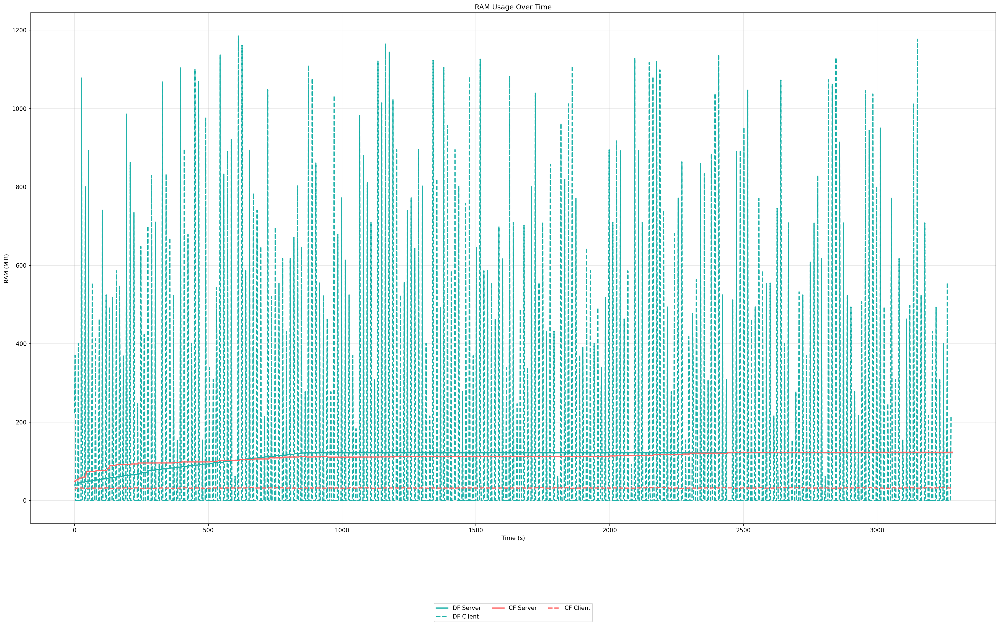
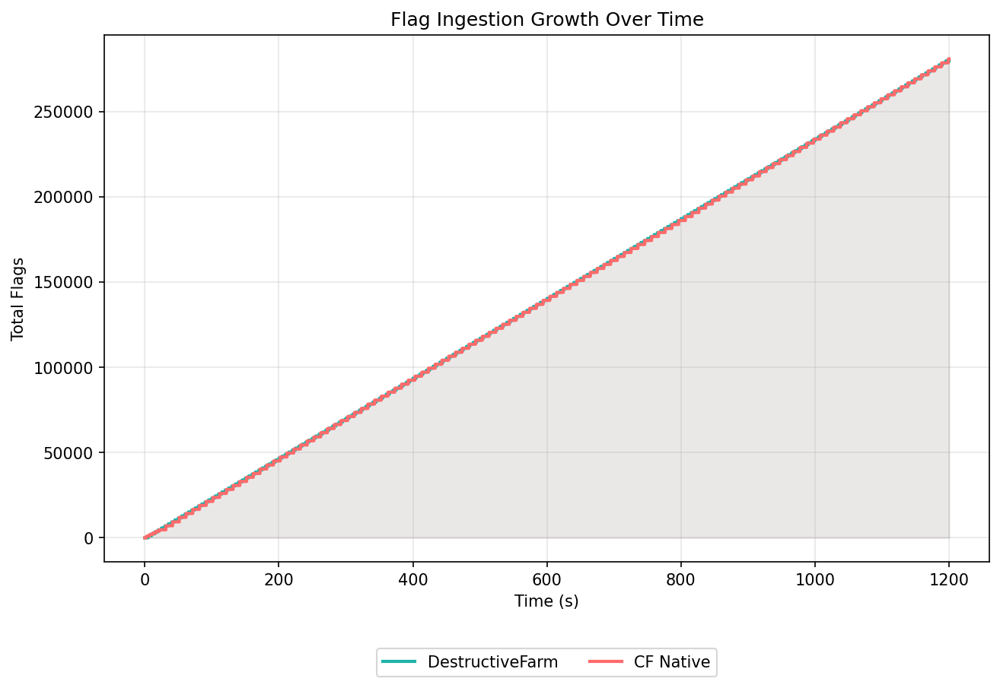
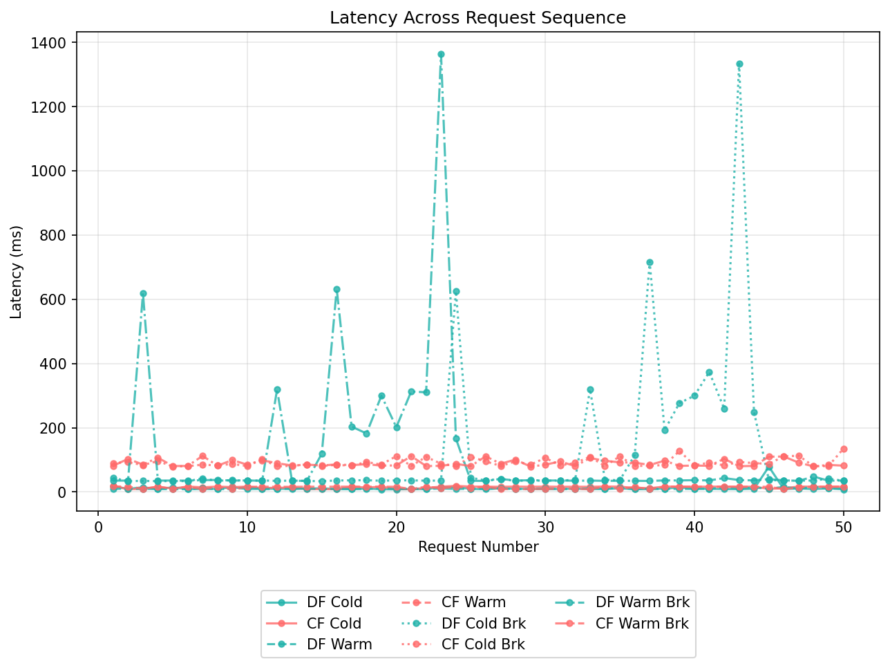

# 📊 Benchmark: CookieFarm vs DestructiveFarm
  
> **Date:** 02-05-2026    
> **CookieFarm commit:** `2b359d52d4791df23de653a6580490162dd441c5`  
> **DestructiveFarm commit:** `69cc5821a16fc38e6670e666bc0c8d5ee311e57a`  
> **Host OS:** Linux 6.18.25-1-lts 
> **CPU:** AMD Ryzen 7 3700X (16) @ 4.43 GHz  
> **RAM:** 32 GB DDR4 @ 3200 MHz
> **GO Version:** go1.26.2
> **Python Version:** Python 3.14.4

---

## ⚙️ Test Parameters

| Parameter | Value |
|-----------|-------|
| Simulated teams | 40 |
| Flags per team per run | 30 |
| Total flags per round | 1,1170 |
| Total rounds | 240 (full 8h A/D) |
| Total flags ingested | 288,000 |
| Round interval | 5s (not realistic but we want MAX) |
| Exploit concurrency | Default |
| Pagination requests sampled | 50 |

## Config used

Cookiefarm's config:

```yaml
configured: true

# Server
server:
  url_flag_checker: "http://localhost:5001/flags"
  team_token: "2b359d52d4791df23de653a6580490162dd441c5"
  submit_flag_checker_time: 30
  max_flag_batch_size: 5000
  protocol: "cc_http"
  tick_time: 30
  flag_ttl: 0 # in ticks
  start_time: "2023-10-01T00:00:00Z"
  end_time: "2023-10-31T23:59:59Z"

# Client
shared:
  services:
    CookieService: 8081
    vulnify: 1337
    app-nc: 1338
  range_ip_teams: 40
  format_ip_teams: "10.10.{}.1"
  my_team_id: 1
  regex_flag: "[A-Z0-9]{31}="
  nop_team: 0
  url_flag_ids: "http://localhost:5001/flagIds"
```

DestructiveFarm's config:

```python
CONFIG = {
    "TEAMS": {"Team #{}".format(i): "10.10.{}.1".format(i) for i in range(1, 40)},
    "FLAG_FORMAT": r"[A-Z0-9]{31}=",
    "SYSTEM_PROTOCOL": "ructf_http",
    "SYSTEM_URL": "http://localhost:5001/flags",
    "SYSTEM_TOKEN": "password",
    "SUBMIT_FLAG_LIMIT": 100,
    "SUBMIT_PERIOD": 5,
    "FLAG_LIFETIME": 5 * 60,
    "SERVER_PASSWORD": "password",
    "ENABLE_API_AUTH": False,
    "API_TOKEN": "00000000000000000000",
}
```

### Exploit used

Cookiefarm's exploit

```python
#!/usr/bin/env python3
import requests
from cookiefarm import exploit_manager

# "ip" are the IP address of the target team (example: 10.10.X.1)
# "port" is the port of the target service (example: 1337)
# "name_service" is the name of the service to exploit (example: "CookieService")
# "flag_ids" is the flag IDs of the target team and target service (example: [{"username": "psQSDAasd", "password": "qweqweqwe"}, {"username": "sdafjhAS", "password": "HIUOasdb"}])


@exploit_manager
def exploit(ip, port, name_service, flag_ids: list):
    for _ in range(30):
        r = requests.get(f"http://{ip}:{port}/get-flag")
        print(r.text)

```

DestructiveFarm's exploit

```python
#!/usr/bin/env python3
import sys

import requests


def exploit(ip, port, name_service, flag_ids: list):
    for _ in range(30):
        r = requests.get(f"http://{ip}:{port}/get-flag")
        print(r.text, flush=True)


exploit(sys.argv[1], 8081, None, [])
```

---

## 🧠 M1 — RAM Usage

> Sampled with `ps -o %cpu,%mem,rss,vsz --no-headers -p $pids`

| State | DestructiveFarm | CookieFarm (Native) 
|-------|:--------------:|:-------------------:|
| Server Idle baseline | 42.7 MiB | 54.2 MiB |
| Server Peak |  121.9 MiB | 123.5 MiB |
| Client Peak |  1185.0 MiB | 32.9 MiB |

### RAM Timeline



---

## ⚡ M2 — CPU Usage

> Sampled with `ps -o %cpu,%mem,rss,vsz --no-headers -p $pids`.

| State | DestructiveFarm | CookieFarm (Native) | 
|-------|:--------------:|:-------------------:|
| Average server | 0.3 |  0.1 |
| Average client | 6.1 | 0.1 |


---

## 🚩 M3 — Flag Store Throughput

> Wall-clock time per round to store all 1,200 flags. 10 rounds total.

| Round | DestructiveFarm (s) | CookieFarm Native (s) |
|:-----:|:-------------------:|:---------------------:|
| **Flags/sec** | **234.0** | **234.3** |



---

## 🌐 M4 — UI Pagination Latency

### Cold Cache (server restarted, no prior requests)

| Percentile | DestructiveFarm | CookieFarm (Native) | 
|:----------:|:--------------:|:-------------------:|
| p50 | 9.8 ms | 16.18 ms |
| p95 | 15.44 ms | 16.9 ms | 
| p99 | 78.5 ms | 19.03 ms | 

### 2M Flags Scale Test

| Percentile | DestructiveFarm | CookieFarm (Native) |
|:----------:|:---------------:|:-------------------:|
| Cold p50 diff (ms) | +26.29 | +69.59 |
| Cold p95 diff (ms) | +609.28 | +95.88 |
| Cold p99 diff (ms) | +1254.83 | +115.70 |
| Warm p50 diff (ms) | +26.21 | +69.08 |
| Warm p95 diff (ms) | +603.70 | +94.28 |
| Warm p99 diff (ms) | +1349.22 | +94.99 |




---

## 📋 Full Summary

| Metric | DestructiveFarm | CookieFarm (Native) | Winner |
|--------|:--------------:|:-------------------:|:------:|
| Server Idle RAM | 42.7 MiB | 54.2 MiB |  DestructiveFarm |
| Server Peak RAM | 121.9 MiB | 123.5 MiB |  DestructiveFarm |
| Client Peak RAM | 1185.0 MiB | 32.9 MiB |  CookieFarm |
| Server Avg CPU% | 0.3% | 0.1% |  CookieFarm |
| Server Peak CPU% | 0.5% | 0.1% | CookieFarm |
| Client Avg CPU% | 6.1% | 0.1% | CookieFarm |
| Client Peak CPU% | 138.0% | 0.4% | CookieFarm |
| Mean ingest time/round | 5.13 s | 5.12 s | CookieFarm |
| Flags/sec | 234.0 | 234.3 | CookieFarm |
| Pagination p50 (cold) | 9.8 ms | 16.18 ms |  DestructiveFarm |
| Pagination p99 (cold) | 78.5 ms | 19.03 ms | CookieFarm |
| 2M Flags Scale p50 Diff (cold) | +26.29 ms | +69.59 ms |  DestructiveFarm |
| 2M Flags Scale p99 Diff (cold) | +1254.83 ms | +115.70 ms |  CookieFarm |

---

## 📁 Raw Data

All raw measurement files are committed under `benchmark/`:

```
output
├── cf_flag_count_timeline.txt
├── cf_latency_cold_breakQUERY.json
├── cf_latency_cold.json
├── cf_latency_warm_breakQUERY.json
├── cf_latency_warm.json
├── charts
│   ├── cpu_summary.png
│   ├── cpu_summary.png.meta.json
│   ├── cpu_timeline.png
│   ├── cpu_timeline.png.meta.json
│   ├── flags_growth.png
│   ├── flags_growth.png.meta.json
│   ├── latency_boxplot.png
│   ├── latency_boxplot.png.meta.json
│   ├── latency_sequence.png
│   ├── latency_sequence.png.meta.json
│   ├── ram_summary.png
│   ├── ram_summary.png.meta.json
│   ├── ram_timeline.png
│   └── ram_timeline.png.meta.json
├── df_flag_count_timeline.txt
├── df_latency_cold_breakQUERY.json
├── df_latency_cold.json
├── df_latency_warm_breakQUERY.json
├── df_latency_warm.json
└── stats_samples.txt
```

To regenerate charts from raw data:

```bash
python3 generate_charts.py \
    --stats ../output/stats_samples.txt \
    --df-flags ../output/df_flag_count_timeline.txt \
    --cf-flags ../output/cf_flag_count_timeline.txt \
    --df-lat ../output/df_latency_cold.json \
    --cf-lat ../output/cf_latency_cold.json \
    --df-lat-warm ../output/df_latency_warm.json \
    --cf-lat-warm ../output/cf_latency_warm.json \
    --df-lat-break ../output/df_latency_cold_breakQUERY.json \
    --cf-lat-break ../output/cf_latency_cold_breakQUERY.json \
    --df-lat-warm-break ../output/df_latency_warm_breakQUERY.json \
    --cf-lat-warm-break ../output/cf_latency_warm_breakQUERY.json \
    --output ../output/charts/
```

---

*CookieFarm — [github.com/ByteTheCookies/CookieFarm](https://github.com/ByteTheCookies/CookieFarm)* 

*DestructiveFarm — [github.com/DestructiveVoice/DestructiveFarm](https://github.com/DestructiveVoice/DestructiveFarm)*
