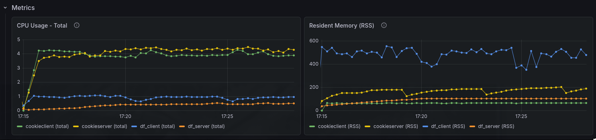

# Benchmark Notes

## 30-04-2025

## Goal

Overload the two solution with 40 hosts, 5 threads per host, 40 ticks, and 30 flag requests.

See difference between DF and CK

### Summary

- 40 hosts
- sha: 69cc5821a16fc38e6670e666bc0c8d5ee311e57a
- branch: dev
- cks version: 1.3.0
- ckc version: 1.3.0

## CK config

### CK Server spec

32 GB RAM
32 vCPU
LAN

(same machine)

- Build command: `just server-build-prod`, `just server-build-plugins-prod`
- Command run: `../bin/cks -c`

### CK Client spec

32 GB RAM
32 vCPU
LAN

(same machine)

- Build command: `just client-build-prod`
- Command run: `./bin/ckc exploit run -e benchmark -n CookieService -t 5 -T 10`

### Cks config used:

```yaml
configured: true

# Server
server:
  url_flag_checker: "http://localhost:5001/flags"
  team_token: ""
  submit_flag_checker_time: 30
  max_flag_batch_size: 5000
  protocol: "cc_http"
  tick_time: 120
  flag_ttl: 0 # in ticks
  start_time: "2023-10-01T00:00:00Z"
  end_time: "2023-10-31T23:59:59Z"

# Client
shared:
  services:
    CookieService: 8081
    vulnify: 1337
    app-nc: 1338
  range_ip_teams: 40
  format_ip_teams: "10.10.{}.1"
  my_team_id: 1
  regex_flag: "[A-Z0-9]{31}="
  nop_team: 0
  url_flag_ids: "http://localhost:5001/flagIds"
```

### Ckc config used:

```yaml
host: 127.0.0.1
username: cookieguest
port: 8080
https: false
```

### Exploit used

```python
#!/usr/bin/env python3
import requests
from cookiefarm import exploit_manager

@exploit_manager
def exploit(ip, port, name_service, flag_ids: list):
    for _ in range(30):
        r = requests.get(f"http://{ip}:{port}/get-flag")
        print(r.text)
```

## DF 

### Server config

```python
CONFIG = {
    "TEAMS": {"Team #{}".format(i): "10.10.{}.1".format(i) for i in range(0, 39 + 1)},
    "FLAG_FORMAT": r"[A-Z0-9]{31}=",
    "SYSTEM_PROTOCOL": "ructf_http",
    "SYSTEM_URL": "http://localhost:5001/submit",
    "SYSTEM_TOKEN": "password",
    "SUBMIT_FLAG_LIMIT": 100,
    "SUBMIT_PERIOD": 5,
    "FLAG_LIFETIME": 5 * 60,
    "SERVER_PASSWORD": "password",
    "ENABLE_API_AUTH": False,
    "API_TOKEN": "00000000000000000000",
}
```


### Exploit used

```python
#!/usr/bin/env python3
import sys

import requests


def exploit(ip, port, name_service, flag_ids: list):
    for _ in range(30):
        r = requests.get(f"http://{ip}:{port}/get-flag")
        print(r.text, flush=True)


exploit(sys.argv[1], 8081, None, [])
```

### Results

#### Perfomance metrics:



We can see a lot of ram usage from the DF client (500mb), but also a lot of CPU usage from the CK client and server (5%). The DF client is using more RAM because he spawn a different process for each team so more team == more ram instead CK client use threads and not process so less ram usage but more CPU usage.

Also the CK server is using more CPU because of some internal constraint given by sqlc.
