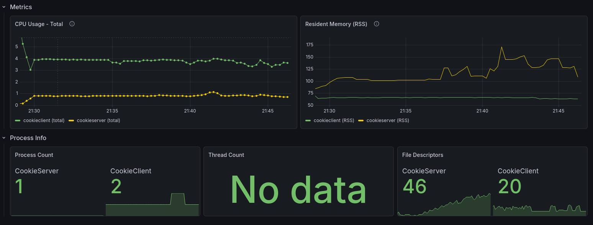
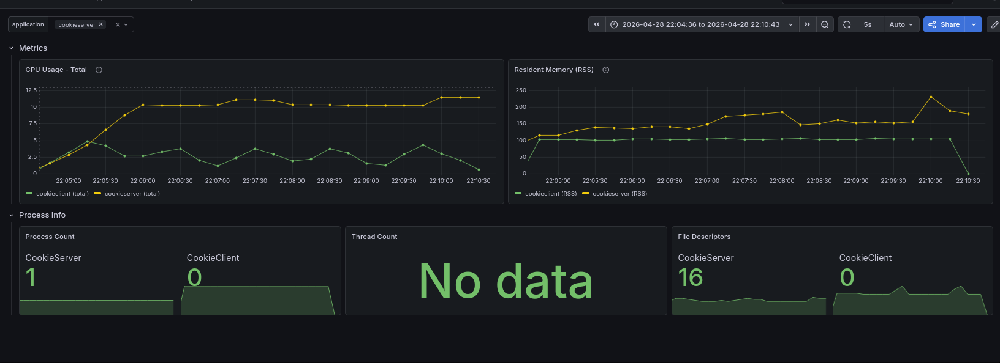

# Benchmark Notes

## 28-04-2025

## Goal

Overload server and client with 40 hosts, 5 threads per host, 40 ticks, and 30 flag requests per thread.

### Summary

- 40 hosts
- sha: ef43801ca25389bc1d191845383eda4ff01519d9
- branch: feature/ckp
- cks version: 1.3.0
- ckc version: 1.3.0

### Server spec

32 GB RAM
32 vCPU
LAN

(same machine)

- Build command: `just server-build-prod`, `just server-build-plugins-prod`
- Command run: `../bin/cks -c`

### Client spec

32 GB RAM
32 vCPU
LAN

(same machine)

- Build command: `just client-build-prod`
- Command run: `./bin/ckc exploit run -e benchmark -n CookieService -t 5 -T 10`

### Cks config used:

```yaml
configured: true

# Server
server:
  url_flag_checker: "http://localhost:5001/flags"
  team_token: ""
  submit_flag_checker_time: 30
  max_flag_batch_size: 5000
  protocol: "cc_http"
  tick_time: 120
  flag_ttl: 0 # in ticks
  start_time: "2023-10-01T00:00:00Z"
  end_time: "2023-10-31T23:59:59Z"

# Client
shared:
  services:
    CookieService: 8081
    vulnify: 1337
    app-nc: 1338
  range_ip_teams: 40
  format_ip_teams: "10.10.{}.1"
  my_team_id: 1
  regex_flag: "[A-Z0-9]{31}="
  nop_team: 0
  url_flag_ids: "http://localhost:5001/flagIds"
```

### Ckc config used:

```yaml
host: 127.0.0.1
username: cookieguest
port: 8080
https: false
```

### Exploit used

```python
#!/usr/bin/env python3
import requests
from cookiefarm import exploit_manager

@exploit_manager
def exploit(ip, port, name_service, flag_ids: list):
    for _ in range(30):
        r = requests.get(f"http://{ip}:{port}/get-flag")
        print(r.text)
```

### Results

#### Perfomance metrics:



### Flags retrieved benchmark:

39 teams x 40 ticks x 30 flag requests = 46,800 flags aspect.

#### Number of flags retrieved with CKP

47,970 I have done a 1 tick more so 47,970 - 1170 (1 tick) = 46,800 flags retrieved with CKP in 40 tick. NO FLAGS LOSS!!!

#### Number of flags retrieved with Websockets

branch dev: sha b6bc2dfc11a96566e482be0fabdbf824675f7a0e

4,525 flags retrieved with Websockets in 40 ticks. 42,275 flags lost with Websockets.



With the websockets the usage of ram and cpu are higher than with CKP, and the number of flags retrieved is much lower.
