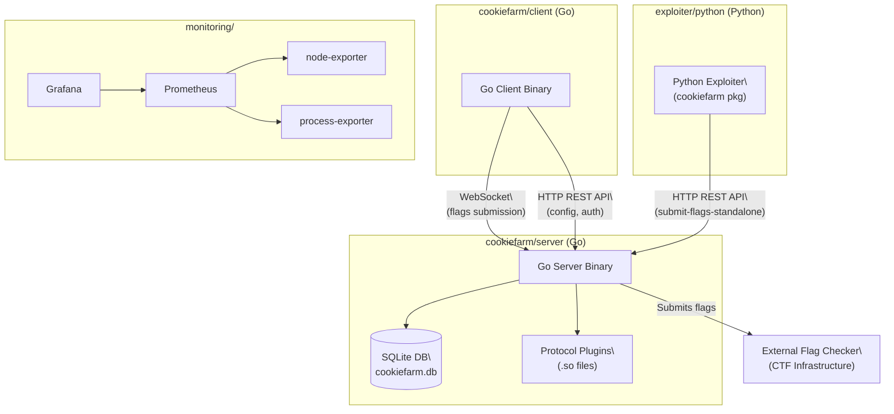
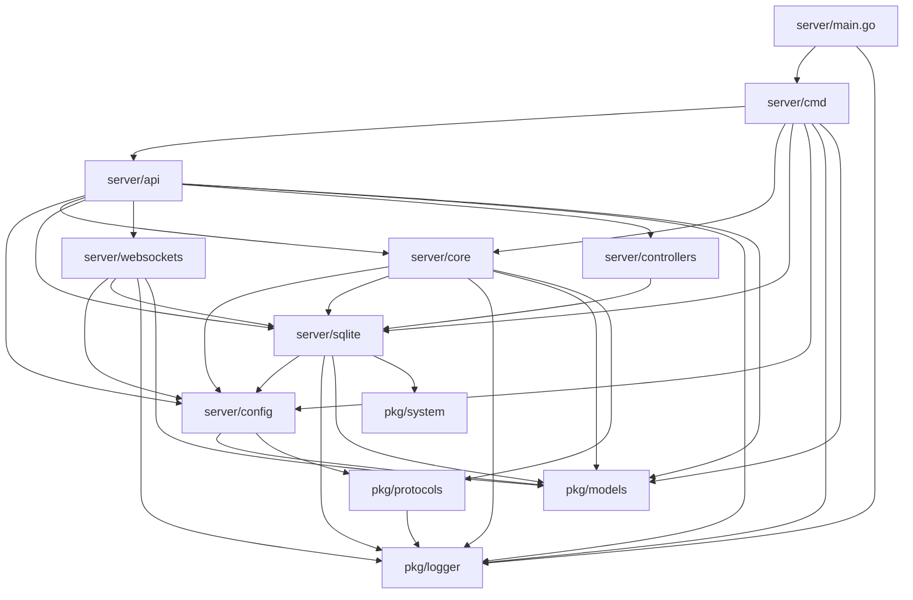
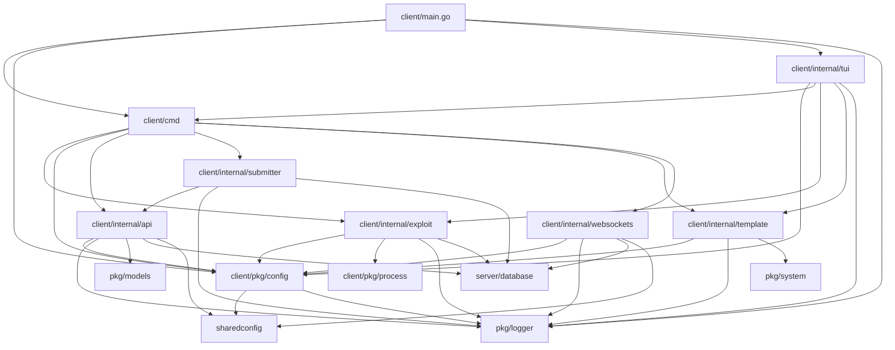
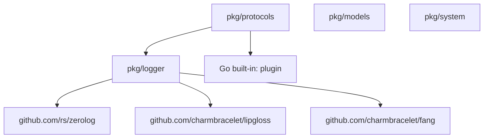

# CookieFarm — Dependency Graph

The project is a monorepo composed of four major areas: a **Go server**, a **Go client**, a **Python exploiter library**, and a **monitoring stack**. Below is a multi-level dependency breakdown.

---

## 1. Top-Level Component Architecture

## 2. Server Internal Package Dependencies

- `server/main.go` imports `server/cmd` and `pkg/logger`
- `server/cmd` (the Cobra root command) wires `server/api`, `server/core`, `server/sqlite`, and `server/config` together at startup.
- `server/api` handles all HTTP routing and calls into `server/sqlite`, `server/core`, `server/websockets`, `server/controllers`, and the shared `pkg/models`.
- `server/core` (flag processing loop) depends on `server/sqlite` to read unsubmitted flags and on `pkg/protocols` to dynamically load the protocol `.so` plugin.
- `server/sqlite` depends on `server/config` (for the DB path), `pkg/system`, `pkg/logger`, `pkg/models`, and the `crawshaw.io/sqlite` driver.
- `server/websockets` depends on `server/config` (for JWT secret), `server/sqlite` (via `FlagCollector`), `pkg/models`, and `pkg/logger`.
- `server/controllers` calls `server/sqlite` directly (via `FlagCollector`) to expose stats.
- `server/config` declares the shared config struct and the `Submit` function type, importing `pkg/models` and `pkg/protocols`.

---

## 3. Client Internal Package Dependencies

The client is structured as a **monorepo-style multi-module Go project** with a clear separation between public packages (`pkg/`) and internal packages (`internal/`):

- `client/main.go` initialises the `ConfigManager` singleton, parses CLI arguments (via `Cobra` + `fang`), and delegates to either `client/internal/tui` or the CLI command tree.
- `client/pkg/config` is the foundational singleton shared by almost every package. It uses `sync/atomic` for lock-free reads and persists state to two YAML files (`client.yml`, `shared.yml`) and a plain `session` token file under `~/.config/cookiefarm/`.
- `client/pkg/process` is a leaf package with no internal dependencies. It provides cross-platform subprocess management (`StartWithContext`, `StartDetached`) with Unix process-group kill semantics (`SIGKILL` to `pgid`).
- `client/internal/exploit` is the execution core: it owns the `Exploits` singleton (thread-safe PID registry), calls `pkg/process` to launch Python scripts, pipes their output through a `Parser` (JSON → `database.Flag`), and exposes the flag stream as a Go channel (`<-chan database.Flag`).
- `client/internal/websockets` consumes the flag channel and streams flags to the server over a persistent WebSocket connection. It implements a **three-state circuit breaker** (Closed / HalfOpen / Open) and a `ConnectionMonitor` that tracks latency, message counts, and performs health-checks every 30 s. It also handles incoming `{type:"config"}` server pushes and updates `pkg/config` in-place.
- `client/internal/submitter` is the HTTP fallback path. It drains the flag channel in batches of 50 and calls `client/internal/api.SubmitBatchDirect`. It is activated when `exploit run/test --submit` is set or when the `exploit submit` command is used.
- `client/internal/api` is a thin HTTP singleton client (10 s timeout) covering `Login`, `GetConfig`, `SubmitBatchDirect`, and `SubmitFlag`. It uses `bytedance/sonic` for JSON and reads the JWT token from `pkg/config`.
- `client/internal/template` creates/removes Python exploit files in `~/.config/cookiefarm/exploits/` using an embedded `@exploit_manager`-decorated template.
- `client/internal/tui` implements the Bubble Tea TUI. It depends on `client/cmd` (to reuse the `LoginHandler`), `client/internal/exploit` and `client/internal/template` (for direct action execution), and `client/pkg/config` (for live config reads). The `CommandRunner` bridges TUI events to package calls; `CommandHandler` dispatches form submissions.

---

## 4. Shared Package (`pkg`) Dependencies

- `pkg/logger` is a leaf shared package wrapping `zerolog`, `lipgloss`, and `fang` – consumed by both server and client.
- `pkg/protocols` dynamically loads `.so` protocol plugins using Go's `plugin` package and logs via `pkg/logger`.
- `pkg/models` defines all shared data structures (`ClientData`, `ConfigShared`, etc.) with no external Go dependencies.

---
