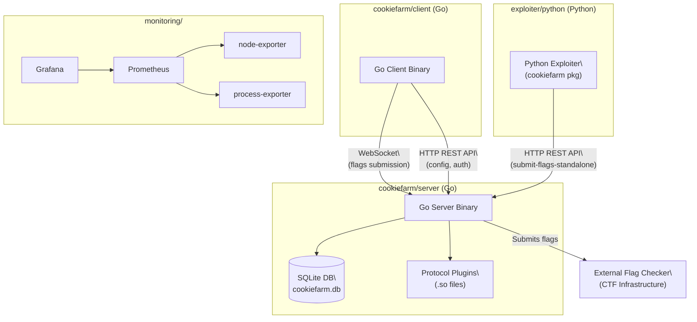
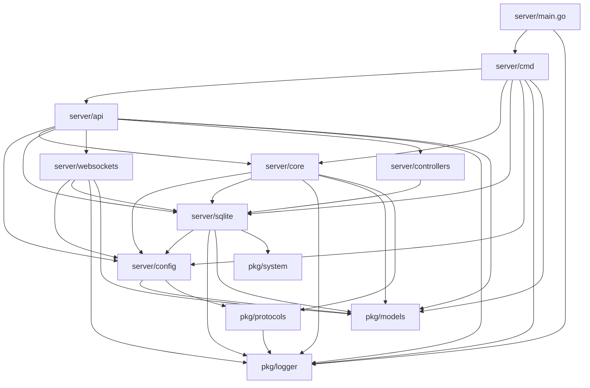
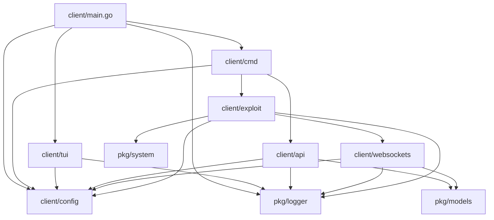
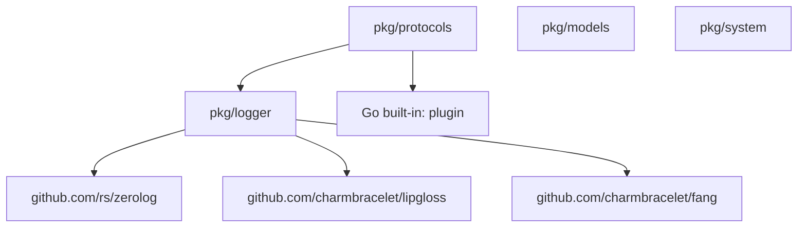

# CookieFarm — Dependency Graph

The project is a monorepo composed of four major areas: a **Go server**, a **Go client**, a **Python exploiter library**, and a **monitoring stack**. Below is a multi-level dependency breakdown.

---

## 1. Top-Level Component Architecture


```

## 2. Server Internal Package Dependencies



- `server/main.go` imports `server/cmd` and `pkg/logger`
- `server/cmd` (the Cobra root command) wires `server/api`, `server/core`, `server/sqlite`, and `server/config` together at startup.
- `server/api` handles all HTTP routing and calls into `server/sqlite`, `server/core`, `server/websockets`, `server/controllers`, and the shared `pkg/models`.
- `server/core` (flag processing loop) depends on `server/sqlite` to read unsubmitted flags and on `pkg/protocols` to dynamically load the protocol `.so` plugin.
- `server/sqlite` depends on `server/config` (for the DB path), `pkg/system`, `pkg/logger`, `pkg/models`, and the `crawshaw.io/sqlite` driver.
- `server/websockets` depends on `server/config` (for JWT secret), `server/sqlite` (via `FlagCollector`), `pkg/models`, and `pkg/logger`.
- `server/controllers` calls `server/sqlite` directly (via `FlagCollector`) to expose stats.
- `server/config` declares the shared config struct and the `Submit` function type, importing `pkg/models` and `pkg/protocols`.

---

## 3. Client Internal Package Dependencies



- `client/main.go` checks for TUI mode and delegates to either `client/tui` or `client/cmd`.
- `client/exploit` is the core: it calls `client/websockets` to stream captured flags to the server, and uses `client/config` and `pkg/system` for process management.
- `client/api` provides HTTP calls (`GetConfig`, `Login`, `SubmitBatchDirect`) and imports `pkg/models` for shared data types. [17](https://www.notion.so/Dependency-Graph-31d5d8cb6b3a8055b91fc1683691ef96?pvs=21)
- `client/websockets` connects to the server WebSocket endpoint, handles the circuit breaker, and dispatches `ConfigEvent` messages by updating `client/config`.
- `client/tui` depends only on `client/config` and `pkg/logger` plus the Charmbracelet UI libraries.

---

## 4. Shared Package (`pkg`) Dependencies



- `pkg/logger` is a leaf shared package wrapping `zerolog`, `lipgloss`, and `fang` – consumed by both server and client.
- `pkg/protocols` dynamically loads `.so` protocol plugins using Go's `plugin` package and logs via `pkg/logger`.
- `pkg/models` defines all shared data structures (`ClientData`, `ConfigShared`, etc.) with no external Go dependencies.

---
