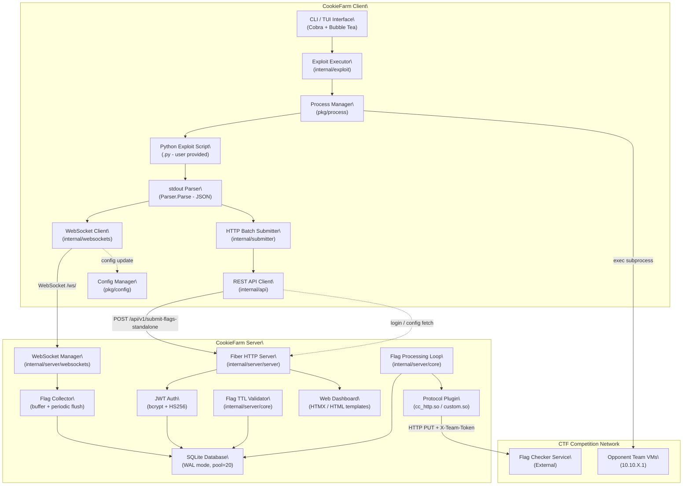
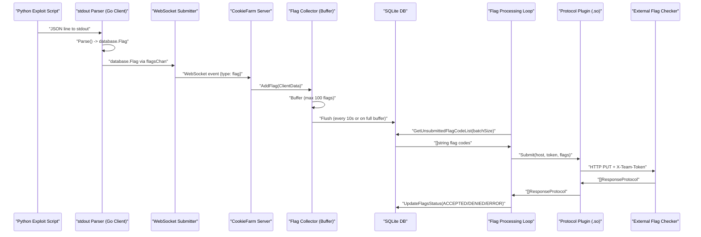

# System Understanding Document — CookieFarm

---

**Purpose:** This document outlines the architecture, components, interfaces, and data flows of the **CookieFarm** system, to ensure it meets the functional and non-functional requirements specified. It serves as a guide for developers, testers, and stakeholders during all stages of the software development lifecycle.

---

## 1. Overview

| Field | Value |
| --- | --- |
| **System Name** | CookieFarm |
| **Prepared By** | ByteTheCookies |
| **Date** | 2025 |
| **Version** | v2.0.0-rc |

CookieFarm is an Attack/Defense CTF framework inspired by DestructiveFarm, developed by **ByteTheCookies**. 

---

## 2. System Objectives

CookieFarm automates the entire flag lifecycle in Attack/Defense CTF competitions:

- **Automate exploit distribution** across all opponent teams, removing manual targeting overhead.
- **Collect flags** captured by exploit scripts and submit them to the official flag checker automatically.
- **Monitor flag statuses** (`UNSUBMITTED`, `ACCEPTED`, `DENIED`, `ERROR`) in real-time through a web interface.
- **Allow participants to focus exclusively on writing exploits** — the system handles the rest.

---

## 3. Scope

The system covers two major runtime boundaries:

**Server-side (Go):**

- Receives and stores flags submitted by clients into a SQLite database.
- Periodically submits batches of unsubmitted flags to the external flag checker service via pluggable protocol adapters.
- Exposes a web dashboard (SSR + HTMX) for monitoring.
- Exposes a RESTful API and a WebSocket endpoint for client communication.

**Client-side (Go + Python):**

- Provides a CLI (`ckc`) and a full TUI (Bubble Tea) interface for managing exploits interactively.
- Manages local configuration (`~/.config/cookiefarm/`) via an atomic `ConfigManager`, persisting connection settings (`client.yml`) and shared CTF metadata (`shared.yml`). JWT session tokens are stored separately in a `session` file.
- Launches Python exploit scripts as subprocesses using a cross-platform `process` package; captures stdout/stderr line-by-line and routes structured JSON to a `Parser` that produces `database.Flag` records.
- Forwards captured flags to the server in real-time via a resilient WebSocket client backed by a **three-state circuit breaker** (Closed → Open after 2 failures, Open → HalfOpen after 30 s) and a **connection monitor** (latency measurement, health-check every 30 s).
- Supports a direct HTTP batch submission fallback (`submitter`) when the `--submit` flag is passed (buffers 50 flags per batch to `/api/v1/submit-flags-standalone`).
- Supports exploit lifecycle management: `create`, `run`, `test`, `list`, `stop`, `remove`, and `submit`.
- Generates Python exploit template files scaffolded with the `@exploit_manager` decorator from the `cookiefarm` Python library.

**Out of scope:**

- The exploit scripts themselves (user-provided Python).
- The external CTF flag checker service.
- The CTF game infrastructure (team IPs, scoring).

---

## 4. Assumptions and Constraints

- **Go 1.26.0+** is required for the server and client binaries.
- **Python 3+** is required to execute exploit scripts.
- **Docker** is required to deploy the server via `docker compose up --build`.
- The server is designed for **Linux/amd64** production deployments (Alpine Docker image).
- Protocol plugins (`.so` files) are compiled separately via `go build -buildmode=plugin`. They must match the Go runtime version of the server binary.
- The default password (`"password"`) **must** be changed before production deployment. Leaving it as default is a critical security risk.
- The server configuration can be provided either via a **YAML file** (`config.yml`) or via the **web form** at runtime.
- The web UI is currently based on HTMX/JavaScript and is **not fully up-to-date**.
- Flag TTL is measured in **ticks** (game rounds), not wall-clock time. Expired flags are automatically deleted.

---

## 5. System Architecture

**Overview:**
CookieFarm is a **distributed, event-driven, hybrid Go + Python** framework. The architecture separates responsibilities cleanly between a **central Go server** (flag storage, checker integration, web dashboard) and a **lightweight Go client** (exploit orchestration, flag capture, flag forwarding). The primary communication channel is **WebSocket**, with a fallback to **direct HTTP REST**. 

### 5.1 Components

| Component | Description |
| --- | --- |
| **`cmd/server` — Server Entrypoint** | Main entrypoint for the Go server binary (`cks`). Initializes the database, loads configuration, starts the Fiber HTTP server and background loops. |
| **`cmd/client` — Client Entrypoint** | Main entrypoint for the Go client binary (`ckc`). Reads the `ConfigManager`, parses CLI args via `Cobra` + `fang` theming, and delegates to TUI mode or the CLI command tree. |
| **`internal/server/server` — HTTP Server** | Built on Fiber v2. Registers all routes (view, public API, private API protected by JWT, WebSocket). Handles CORS, rate limiting, static file serving, and compression.  |
| **`internal/server/core` — Flag Processing Engine** | Contains `StartFlagProcessingLoop` (periodic batch submission to flag checker) and `ValidateFlagTTL` (expired flag cleanup). Both run as independent goroutines with cancellable contexts. |
| **`internal/server/database` — Database Layer** | SQLite-backed persistence using a connection pool of size 20 with WAL mode. Provides CRUD operations for flags. Includes a `FlagCollector` singleton with an in-memory buffer (100 flags) and periodic flush (10s). |
| **`internal/server/websockets` — WebSocket Manager** | Manages connected clients, routes events (`flag`, `config`) to handlers. The `FlagHandler` routes incoming flags to the `FlagCollector`.  |
| **`internal/server/controllers` — Stats Controller** | Provides flag collector statistics: total received, flushed, buffer size, efficiency ratio.  |
| **`pkg/protocols` — Protocol Plugin System** | Dynamically loads `.so` plugins at runtime via Go's `plugin` package. Each plugin exposes a `Submit(host, token, flags)` function. The built-in `cc_http` protocol submits flags via HTTP PUT with `X-Team-Token`.  |
| **`client/pkg/config` — Config Manager** | Singleton `ConfigManager` backed by `sync/atomic` for lock-free reads. Persists `LocalConfig` (host, port, username, HTTPS) to `~/.config/cookiefarm/client.yml` and `SharedConfig` (services map, regex, team IP range) to `shared.yml`. Manages the JWT session token stored at `~/.config/cookiefarm/session`. |
| **`client/pkg/process` — Process Manager** | Cross-platform subprocess launcher. `StartWithContext` creates a context-cancellable process with piped stdout/stderr. `StartDetached` spawns background processes. On Unix, processes are placed in their own process group (`Setpgid=true`) and killed by sending `SIGKILL` to the entire group. |
| **`client/internal/api` — REST API Client** | HTTP client singleton (10 s timeout) for server interactions: `Login` (POST form → JWT cookie stored in `ConfigManager`), `GetConfig` (GET shared config), `SubmitBatchDirect` (POST batch to `/api/v1/submit-flags-standalone`), `SubmitFlag` (POST single to `/api/v1/submit-flag`). Uses `bytedance/sonic` for fast JSON marshalling. |
| **`client/internal/exploit` — Exploit Executor** | Manages exploit subprocess lifecycle via the `Exploits` singleton (thread-safe `map[pid]name` + `map[pid]*ExecutionResult`). `Start` launches a Python exploit with `process.StartWithContext`, creates a `Parser` (deserialises JSON lines into `ParsedFlagOutput` / `StatusBatchOutput`), and returns an `ExecutionResult` with `Flags <-chan database.Flag` and `Output <-chan string` channels. Stdout and Stderr are each processed by a dedicated goroutine. |
| **`client/internal/submitter` — HTTP Batch Submitter** | Direct HTTP fallback for flag submission. `SubmitFlags` drains the `Flags` channel and calls `api.SubmitBatchDirect` in batches of 50. `SubmitFlag` submits a single `database.Flag` immediately. Used when `exploit run/test --submit` is set, or by the `exploit submit` CLI command. |
| **`client/internal/template` — Exploit Template Manager** | Creates and removes Python exploit files in `~/.config/cookiefarm/exploits/`. The embedded template scaffolds an `@exploit_manager`-decorated function matching the `cookiefarm` Python library interface (`ip`, `port`, `name_service`, `flag_ids`). |
| **`client/internal/tui` — Terminal UI** | Bubble Tea TUI with three navigable menus (main, config, exploit). `CommandRunner` bridges menu actions to internal packages. `CommandHandler` dispatches form submissions and handles navigation. Forms are dynamically generated per command (`CreateForm`) with validation (`ValidateForm`). An `exploitTable` (`charmbracelet/bubbles/table`) displays running exploit PIDs. Styling (`styles.go`) uses a cookie-gold primary colour (`#CDA157`). |
| **`client/internal/websockets` — WebSocket Client** | Maintains a WebSocket connection to `/ws/`. Implements a three-state **Circuit Breaker** (`Closed → Open` after 2 consecutive failures, `Open → HalfOpen` after 30 s). A singleton `ConnectionMonitor` tracks connection stats, latency (ping/pong round-trip), messages sent/received, and runs health-checks every 30 s. `ConfigHandler` processes server-pushed `{type:"config"}` events and updates `ConfigManager` in-place. |
| **`internal/server/ui` — Template Engine** | Server-side rendering using Go HTML templates (Fiber template engine). Serves dashboard and login views. |
| **`frontend/` — Next.js Frontend (WIP)** | A new React/Next.js-based frontend under development, currently disabled in `docker-compose.yml`.  |
| **`pkg/models` — Shared Data Models** | Defines all shared structs: `ClientData`, `ConfigShared`, `ConfigServer`, `ConfigClient`, `Service`, `SubmitFlagsRequest`.  |

### 5.2 System Diagram

The following diagram illustrates the overall system topology and data flow:

---

## 6. Data Design

**Data Flow Description:**
Flags flow in one direction: from Python exploit stdout → Go client parser → WebSocket (or HTTP) → Server → SQLite. The server's flag processing loop independently reads unsubmitted flags from SQLite on a configurable timer, submits them to the external flag checker via a protocol plugin, and updates their status (`ACCEPTED`, `DENIED`, `ERROR`) back in SQLite. 

### 6.1 Data Entities

| Entity Name | Description |
| --- | --- |
| **`database.Flag`** | Core flag entity (formerly `ClientData`). Contains `flag_code`, `service_name`, `port_service`, `team_id`, `status`, `username`, `exploit_name`, `submit_time`, `response_time`, `msg`. This is the primary record persisted in SQLite and exchanged between client and server via WebSocket (`EventWSFlag`) or HTTP (`SubmitFlagsRequest`). |
| **`sharedconfig.Shared`** | Shared configuration struct pushed from server to client via WebSocket `{type:"config"}` events. Contains a `services` map (`name → port`), `regex_flag`, `format_ip_teams`, `range_ip_teams`, `my_team_id`, `nop_team`, and `url_flag_ids`. Stored by the client in `~/.config/cookiefarm/shared.yml`. |
| **`ConfigServer`** | Server-side configuration: `url_flag_checker`, `team_token`, `protocol`, `tick_time`, `submit_flag_checker_time`, `max_flag_batch_size`, `flag_ttl`, `start_time`, `end_time`.  |
| **`config.LocalConfig`** | Client-local connection settings: `host`, `port`, `username`, `https`. Persisted to `~/.config/cookiefarm/client.yml` and never sent to the server. |
| **`Service`** | Represents a single exploitable CTF service, with a `name` and `port`.  |
| **`ResponseProtocol`** | Response from the flag checker per flag: `status` (`ACCEPTED`/`DENIED`/`RESUBMIT`/`ERROR`), `flag`, `msg`.  |
| **`ParsedFlagOutput`** | JSON structure emitted by Python exploit scripts to stdout. Contains `status`, `flag_code`, `name_service`, `message`, `team_id`, `port_service`.  |
| **`StatusBatchOutput`** | JSON structure for batch statistics emitted by exploit scripts: `total_flag`, `success_team`, `failed_team`.  |
| **`FlagCollector`** | Server-side in-memory buffer (singleton). Holds up to 100 flags before flushing to SQLite. Tracks `CollectorStats` (total received, flushed, flush errors).  |

### 6.2 Data Flow Diagrams

**Flag Capture & Submission Flow:**

**Flag TTL Cleanup Flow:**

- `ValidateFlagTTL` runs on a ticker equal to `flagTTL × tickTime` seconds.
- On each tick, it calls `DeleteTTLFlag` to purge flags older than `flagTTL` ticks.

**Configuration Update Flow:**

- `POST /api/v1/config` → updates `SharedConfig` → cancels existing background goroutines → restarts `StartFlagProcessingLoop` and `ValidateFlagTTL` with new config → broadcasts config update to all WebSocket clients.

---

## 7. Interfaces

### 7.1 External Interfaces

| Name | Type | Description |
| --- | --- | --- |
| **Flag Checker Service** | HTTP (via Protocol Plugin) | The server submits captured flags via a dynamically loaded `.so` plugin. The default `cc_http` plugin sends an HTTP PUT request with flags as a JSON array and sets the `X-Team-Token` header. Accepts responses as `[]ResponseProtocol`.  |
| **Flag IDs Service** | HTTP (GET) | Optional external service for CyberChallenge-AD competitions that provides flag IDs. Configured via `url_flag_ids` in `ConfigClient`.  |
| **Opponent Team VMs** | TCP (via Python exploit) | Exploit scripts connect directly to opponent VMs using the IP pattern `format_ip_teams` (e.g., `10.10.{}.1`) across `range_ip_teams` team IDs, targeting the service port configured in `ConfigClient.Services`.  |
| **Web Browser (Dashboard)** | HTTP/HTTPS | End users access the server web interface at `http://<server_ip>:<port>`. Provides flag monitoring, status display, and server configuration form.  |

### 7.2 Internal Interfaces

| Name | Description |
| --- | --- |
| **`GET /api/v1/` (Public)** | Health check endpoint. Returns server status and current UTC time.  |
| **`POST /api/v1/auth/login` (Public, rate-limited)** | Authenticates with password, returns a JWT as an `HttpOnly` cookie (`token`) valid for 48 hours.  |
| **`GET /api/v1/protocols` (Public)** | Lists available protocol plugins (`.so` files) on the server filesystem.  |
| **`GET /api/v1/flags` (Private - JWT)** | Returns all flags stored in the database, ordered by submit time descending.  |
| **`GET /api/v1/flags/:limit` (Private - JWT)** | Returns paginated flags. Supports `?offset=N` query param.  |
| **`GET /api/v1/stats` (Private - JWT)** | Returns flag collector statistics: buffer size, total received/flushed, flush counts, efficiency ratio.  |
| **`GET /api/v1/config` (Private - JWT)** | Returns the current `ConfigShared` as JSON.  |
| **`POST /api/v1/submit-flags` (Private - JWT)** | Batch insert flags into the database (deferred checker submission via periodic loop).  |
| **`POST /api/v1/submit-flag` (Private - JWT)** | Insert a single flag AND immediately submit it to the flag checker.  |
| **`POST /api/v1/submit-flags-standalone` (Private - JWT)** | Batch insert flags AND immediately submit them all to the flag checker. Used by the client HTTP fallback.  |
| **`POST /api/v1/config` (Private - JWT)** | Updates `SharedConfig`, restarts background goroutines, broadcasts config update to all WS clients.  |
| **`DELETE /api/v1/delete-flag` (Private - JWT)** | Deletes a single flag by its `flag_code` query param.  |
| **`GET /ws` — WebSocket** | Real-time bidirectional channel. Client sends `{type: "flag", payload: ClientData}`. Server acknowledges with `{type: "flag_response"}`. Config push uses `{type: "config"}`.  |
| **`FlagCollector.AddFlag()` (Internal)** | Thread-safe in-process interface for adding flags to the buffer. Triggers immediate flush if buffer reaches 100 entries.  |
| **`protocols.LoadProtocol()` (Internal)** | Dynamically loads a protocol `.so` plugin by name and returns the `Submit` function pointer for use by the flag processing loop.  |

---

## 8. Security Considerations

- **Password Authentication:** The server requires a password set via the `PASSWORD` environment variable. Passwords are hashed at startup using **bcrypt** (`DefaultCost`). Login attempts compare against the stored bcrypt hash.
- **JWT Tokens:** After successful login, a **JWT (HS256)** is issued with a 24-hour expiry and embedded in an `HttpOnly`, `SameSite=Strict` cookie named `token`. The signing secret is a 32-byte cryptographically random value generated at each server startup.

Through the UI you can:

- View all received flags.
- Check the submission and acceptance status of each flag.
- Configure the server (unless you setup the configuration from YAML file).

---

## **9. Performance Requirements**

Still to be determined with numeric/statistic value, but as little CPU and memory as possible.

---

## 🗒️ Important Notes

- Never push directly to `dev` branch!!
- NEVER PUSH DIRECTLY TO `main` BRANCH!!
- Test your code before pushing (test environment in `/tests`)
- Make sure your branch is up to date with `dev` before creating a PR
- Delete your branch after it has been merged
