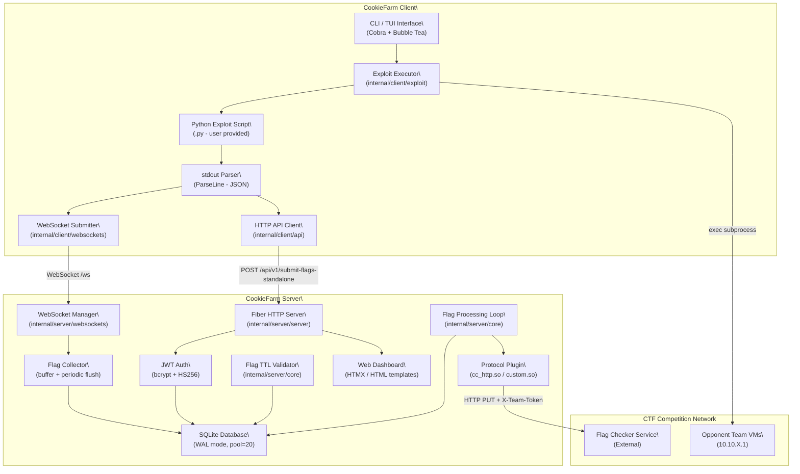
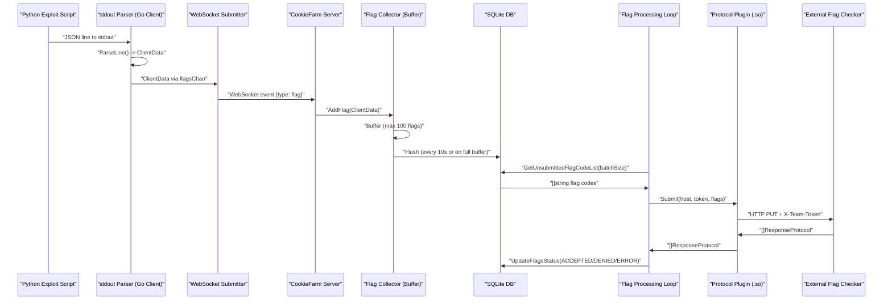

# System Understanding Document — CookieFarm

---

**Purpose:** This document outlines the architecture, components, interfaces, and data flows of the **CookieFarm** system, to ensure it meets the functional and non-functional requirements specified. It serves as a guide for developers, testers, and stakeholders during all stages of the software development lifecycle.

---

## 1. Overview

| Field | Value |
| --- | --- |
| **System Name** | CookieFarm |
| **Prepared By** | ByteTheCookies |
| **Date** | 2025 |
| **Version** | v2.0.0-rc |

CookieFarm is an Attack/Defense CTF framework inspired by DestructiveFarm, developed by **ByteTheCookies**. [1](https://www.notion.so/System-Understanding-31d5d8cb6b3a80c3b2d1e710aedfaa01?pvs=21)

---

## 2. System Objectives

CookieFarm automates the entire flag lifecycle in Attack/Defense CTF competitions:

- **Automate exploit distribution** across all opponent teams, removing manual targeting overhead.
- **Collect flags** captured by exploit scripts and submit them to the official flag checker automatically.
- **Monitor flag statuses** (`UNSUBMITTED`, `ACCEPTED`, `DENIED`, `ERROR`) in real-time through a web interface.
- **Allow participants to focus exclusively on writing exploits** — the system handles the rest. [2](https://www.notion.so/System-Understanding-31d5d8cb6b3a80c3b2d1e710aedfaa01?pvs=21) [3](https://www.notion.so/System-Understanding-31d5d8cb6b3a80c3b2d1e710aedfaa01?pvs=21)

---

## 3. Scope

The system covers two major runtime boundaries:

**Server-side (Go):**

- Receives and stores flags submitted by clients into a SQLite database.
- Periodically submits batches of unsubmitted flags to the external flag checker service via pluggable protocol adapters.
- Exposes a web dashboard (SSR + HTMX) for monitoring.
- Exposes a RESTful API and a WebSocket endpoint for client communication. [4](https://www.notion.so/System-Understanding-31d5d8cb6b3a80c3b2d1e710aedfaa01?pvs=21)

**Client-side (Go + Python):**

- Provides a CLI (`ckc`) and TUI interface for managing exploits.
- Launches Python exploit scripts as subprocesses, captures their stdout as structured JSON flag data, and forwards them to the server via WebSocket.
- Supports exploit lifecycle management: create, run, test, list, stop, remove. [5](https://www.notion.so/System-Understanding-31d5d8cb6b3a80c3b2d1e710aedfaa01?pvs=21)

**Out of scope:**

- The exploit scripts themselves (user-provided Python).
- The external CTF flag checker service.
- The CTF game infrastructure (team IPs, scoring).

---

## 4. Assumptions and Constraints

- **Go 1.26.0+** is required for the server and client binaries. [6](https://www.notion.so/System-Understanding-31d5d8cb6b3a80c3b2d1e710aedfaa01?pvs=21)
- **Python 3+** is required to execute exploit scripts. [7](https://www.notion.so/System-Understanding-31d5d8cb6b3a80c3b2d1e710aedfaa01?pvs=21)
- **Docker** is required to deploy the server via `docker compose up --build`. [8](https://www.notion.so/System-Understanding-31d5d8cb6b3a80c3b2d1e710aedfaa01?pvs=21)
- The server is designed for **Linux/amd64** production deployments (Alpine Docker image). [9](https://www.notion.so/System-Understanding-31d5d8cb6b3a80c3b2d1e710aedfaa01?pvs=21)
- Protocol plugins (`.so` files) are compiled separately via `go build -buildmode=plugin`. They must match the Go runtime version of the server binary. [10](https://www.notion.so/System-Understanding-31d5d8cb6b3a80c3b2d1e710aedfaa01?pvs=21)
- The default password (`"password"`) **must** be changed before production deployment. Leaving it as default is a critical security risk. [11](https://www.notion.so/System-Understanding-31d5d8cb6b3a80c3b2d1e710aedfaa01?pvs=21)
- The server configuration can be provided either via a **YAML file** (`config.yml`) or via the **web form** at runtime. [12](https://www.notion.so/System-Understanding-31d5d8cb6b3a80c3b2d1e710aedfaa01?pvs=21)
- The web UI is currently based on HTMX/JavaScript and is **not fully up-to-date**. [13](https://www.notion.so/System-Understanding-31d5d8cb6b3a80c3b2d1e710aedfaa01?pvs=21)
- Flag TTL is measured in **ticks** (game rounds), not wall-clock time. Expired flags are automatically deleted. [14](https://www.notion.so/System-Understanding-31d5d8cb6b3a80c3b2d1e710aedfaa01?pvs=21)

---

## 5. System Architecture

**Overview:**
CookieFarm is a **distributed, event-driven, hybrid Go + Python** framework. The architecture separates responsibilities cleanly between a **central Go server** (flag storage, checker integration, web dashboard) and a **lightweight Go client** (exploit orchestration, flag capture, flag forwarding). The primary communication channel is **WebSocket**, with a fallback to **direct HTTP REST**. [16](https://www.notion.so/System-Understanding-31d5d8cb6b3a80c3b2d1e710aedfaa01?pvs=21)

### 5.1 Components

| Component | Description |
| --- | --- |
| **`cmd/server` — Server Entrypoint** | Main entrypoint for the Go server binary (`cks`). Initializes the database, loads configuration, starts the Fiber HTTP server and background loops. |
| **`cmd/client` — Client Entrypoint** | Main entrypoint for the Go client binary (`ckc`). Bootstraps the CLI (Cobra) and TUI (Bubble Tea) interfaces. |
| **`internal/server/server` — HTTP Server** | Built on Fiber v2. Registers all routes (view, public API, private API protected by JWT, WebSocket). Handles CORS, rate limiting, static file serving, and compression. [17](https://www.notion.so/System-Understanding-31d5d8cb6b3a80c3b2d1e710aedfaa01?pvs=21) |
| **`internal/server/core` — Flag Processing Engine** | Contains `StartFlagProcessingLoop` (periodic batch submission to flag checker) and `ValidateFlagTTL` (expired flag cleanup). Both run as independent goroutines with cancellable contexts. [18](https://www.notion.so/System-Understanding-31d5d8cb6b3a80c3b2d1e710aedfaa01?pvs=21) |
| **`internal/server/sqlite` — Database Layer** | SQLite-backed persistence using a connection pool of size 20 with WAL mode. Provides CRUD operations for flags. Includes a `FlagCollector` singleton with an in-memory buffer (100 flags) and periodic flush (10s). [19](https://www.notion.so/System-Understanding-31d5d8cb6b3a80c3b2d1e710aedfaa01?pvs=21) |
| **`internal/server/websockets` — WebSocket Manager** | Manages connected clients, routes events (`flag`, `config`) to handlers. The `FlagHandler` routes incoming flags to the `FlagCollector`. [20](https://www.notion.so/System-Understanding-31d5d8cb6b3a80c3b2d1e710aedfaa01?pvs=21) |
| **`internal/server/controllers` — Stats Controller** | Provides flag collector statistics: total received, flushed, buffer size, efficiency ratio. [21](https://www.notion.so/System-Understanding-31d5d8cb6b3a80c3b2d1e710aedfaa01?pvs=21) |
| **`pkg/protocols` — Protocol Plugin System** | Dynamically loads `.so` plugins at runtime via Go's `plugin` package. Each plugin exposes a `Submit(host, token, flags)` function. The built-in `cc_http` protocol submits flags via HTTP PUT with `X-Team-Token`. [22](https://www.notion.so/System-Understanding-31d5d8cb6b3a80c3b2d1e710aedfaa01?pvs=21) |
| **`internal/client/exploit` — Exploit Executor** | Launches Python exploit scripts as subprocesses. Reads stdout line-by-line, parsing structured JSON into `ClientData` flag objects. Manages exploit lifecycle (run, stop, restart on config change). [23](https://www.notion.so/System-Understanding-31d5d8cb6b3a80c3b2d1e710aedfaa01?pvs=21) |
| **`internal/client/websockets` — Client WebSocket Submitter** | Maintains a WebSocket connection to the server and forwards parsed flags in real-time. Supports reconnection on failure. [24](https://www.notion.so/System-Understanding-31d5d8cb6b3a80c3b2d1e710aedfaa01?pvs=21) |
| **`internal/client/api` — REST API Client** | HTTP client for server interactions: login (JWT cookie retrieval), config fetch, direct flag/batch submission. [25](https://www.notion.so/System-Understanding-31d5d8cb6b3a80c3b2d1e710aedfaa01?pvs=21) |
| **`internal/server/ui` — Template Engine** | Server-side rendering using Go HTML templates (Fiber template engine). Serves dashboard and login views. |
| **`frontend/` — Next.js Frontend (WIP)** | A new React/Next.js-based frontend under development, currently disabled in `docker-compose.yml`. [26](https://www.notion.so/System-Understanding-31d5d8cb6b3a80c3b2d1e710aedfaa01?pvs=21) |
| **`pkg/models` — Shared Data Models** | Defines all shared structs: `ClientData`, `ConfigShared`, `ConfigServer`, `ConfigClient`, `Service`, `SubmitFlagsRequest`. [27](https://www.notion.so/System-Understanding-31d5d8cb6b3a80c3b2d1e710aedfaa01?pvs=21) |

### 5.2 System Diagram

The following diagram illustrates the overall system topology and data flow:



---

## 6. Data Design

**Data Flow Description:**
Flags flow in one direction: from Python exploit stdout → Go client parser → WebSocket (or HTTP) → Server → SQLite. The server's flag processing loop independently reads unsubmitted flags from SQLite on a configurable timer, submits them to the external flag checker via a protocol plugin, and updates their status (`ACCEPTED`, `DENIED`, `ERROR`) back in SQLite. [18](https://www.notion.so/System-Understanding-31d5d8cb6b3a80c3b2d1e710aedfaa01?pvs=21) [28](https://www.notion.so/System-Understanding-31d5d8cb6b3a80c3b2d1e710aedfaa01?pvs=21)

### 6.1 Data Entities

| Entity Name | Description |
| --- | --- |
| **`ClientData`** | Core flag entity. Contains `flag_code`, `service_name`, `port_service`, `team_id`, `status`, `username`, `exploit_name`, `submit_time`, `response_time`, `msg`. This is the primary record persisted in SQLite and exchanged between client and server. [29](https://www.notion.so/System-Understanding-31d5d8cb6b3a80c3b2d1e710aedfaa01?pvs=21) |
| **`ConfigShared`** | Aggregated configuration struct shared between server and client contexts. Contains `ConfigServer`, `ConfigClient`, and a `Configured` boolean flag. [30](https://www.notion.so/System-Understanding-31d5d8cb6b3a80c3b2d1e710aedfaa01?pvs=21) |
| **`ConfigServer`** | Server-side configuration: `url_flag_checker`, `team_token`, `protocol`, `tick_time`, `submit_flag_checker_time`, `max_flag_batch_size`, `flag_ttl`, `start_time`, `end_time`. [31](https://www.notion.so/System-Understanding-31d5d8cb6b3a80c3b2d1e710aedfaa01?pvs=21) |
| **`ConfigClient`** | Client-side configuration: `services` list, `regex_flag`, `format_ip_teams`, `range_ip_teams`, `my_team_id`, `nop_team`, `url_flag_ids`. [32](https://www.notion.so/System-Understanding-31d5d8cb6b3a80c3b2d1e710aedfaa01?pvs=21) |
| **`Service`** | Represents a single exploitable CTF service, with a `name` and `port`. [33](https://www.notion.so/System-Understanding-31d5d8cb6b3a80c3b2d1e710aedfaa01?pvs=21) |
| **`ResponseProtocol`** | Response from the flag checker per flag: `status` (`ACCEPTED`/`DENIED`/`RESUBMIT`/`ERROR`), `flag`, `msg`. [34](https://www.notion.so/System-Understanding-31d5d8cb6b3a80c3b2d1e710aedfaa01?pvs=21) |
| **`ParsedFlagOutput`** | JSON structure emitted by Python exploit scripts to stdout. Contains `status`, `flag_code`, `name_service`, `message`, `team_id`, `port_service`. [35](https://www.notion.so/System-Understanding-31d5d8cb6b3a80c3b2d1e710aedfaa01?pvs=21) |
| **`StatusBatchOutput`** | JSON structure for batch statistics emitted by exploit scripts: `total_flag`, `success_team`, `failed_team`. [36](https://www.notion.so/System-Understanding-31d5d8cb6b3a80c3b2d1e710aedfaa01?pvs=21) |
| **`FlagCollector`** | Server-side in-memory buffer (singleton). Holds up to 100 flags before flushing to SQLite. Tracks `CollectorStats` (total received, flushed, flush errors). [37](https://www.notion.so/System-Understanding-31d5d8cb6b3a80c3b2d1e710aedfaa01?pvs=21) |

### 6.2 Data Flow Diagrams

**Flag Capture & Submission Flow:**



**Flag TTL Cleanup Flow:**

- `ValidateFlagTTL` runs on a ticker equal to `flagTTL × tickTime` seconds.
- On each tick, it calls `DeleteTTLFlag` to purge flags older than `flagTTL` ticks. [38](https://www.notion.so/System-Understanding-31d5d8cb6b3a80c3b2d1e710aedfaa01?pvs=21)

**Configuration Update Flow:**

- `POST /api/v1/config` → updates `SharedConfig` → cancels existing background goroutines → restarts `StartFlagProcessingLoop` and `ValidateFlagTTL` with new config → broadcasts config update to all WebSocket clients. [39](https://www.notion.so/System-Understanding-31d5d8cb6b3a80c3b2d1e710aedfaa01?pvs=21)

---

## 7. Interfaces

### 7.1 External Interfaces

| Name | Type | Description |
| --- | --- | --- |
| **Flag Checker Service** | HTTP (via Protocol Plugin) | The server submits captured flags via a dynamically loaded `.so` plugin. The default `cc_http` plugin sends an HTTP PUT request with flags as a JSON array and sets the `X-Team-Token` header. Accepts responses as `[]ResponseProtocol`. [40](https://www.notion.so/System-Understanding-31d5d8cb6b3a80c3b2d1e710aedfaa01?pvs=21) |
| **Flag IDs Service** | HTTP (GET) | Optional external service for CyberChallenge-AD competitions that provides flag IDs. Configured via `url_flag_ids` in `ConfigClient`. [41](https://www.notion.so/System-Understanding-31d5d8cb6b3a80c3b2d1e710aedfaa01?pvs=21) |
| **Opponent Team VMs** | TCP (via Python exploit) | Exploit scripts connect directly to opponent VMs using the IP pattern `format_ip_teams` (e.g., `10.10.{}.1`) across `range_ip_teams` team IDs, targeting the service port configured in `ConfigClient.Services`. [42](https://www.notion.so/System-Understanding-31d5d8cb6b3a80c3b2d1e710aedfaa01?pvs=21) |
| **Web Browser (Dashboard)** | HTTP/HTTPS | End users access the server web interface at `http://<server_ip>:<port>`. Provides flag monitoring, status display, and server configuration form. [43](https://www.notion.so/System-Understanding-31d5d8cb6b3a80c3b2d1e710aedfaa01?pvs=21) |

### 7.2 Internal Interfaces

| Name | Description |
| --- | --- |
| **`GET /api/v1/` (Public)** | Health check endpoint. Returns server status and current UTC time. [44](https://www.notion.so/System-Understanding-31d5d8cb6b3a80c3b2d1e710aedfaa01?pvs=21) |
| **`POST /api/v1/auth/login` (Public, rate-limited)** | Authenticates with password, returns a JWT as an `HttpOnly` cookie (`token`) valid for 48 hours. [45](https://www.notion.so/System-Understanding-31d5d8cb6b3a80c3b2d1e710aedfaa01?pvs=21) |
| **`GET /api/v1/protocols` (Public)** | Lists available protocol plugins (`.so` files) on the server filesystem. [46](https://www.notion.so/System-Understanding-31d5d8cb6b3a80c3b2d1e710aedfaa01?pvs=21) |
| **`GET /api/v1/flags` (Private - JWT)** | Returns all flags stored in the database, ordered by submit time descending. [47](https://www.notion.so/System-Understanding-31d5d8cb6b3a80c3b2d1e710aedfaa01?pvs=21) |
| **`GET /api/v1/flags/:limit` (Private - JWT)** | Returns paginated flags. Supports `?offset=N` query param. [48](https://www.notion.so/System-Understanding-31d5d8cb6b3a80c3b2d1e710aedfaa01?pvs=21) |
| **`GET /api/v1/stats` (Private - JWT)** | Returns flag collector statistics: buffer size, total received/flushed, flush counts, efficiency ratio. [21](https://www.notion.so/System-Understanding-31d5d8cb6b3a80c3b2d1e710aedfaa01?pvs=21) |
| **`GET /api/v1/config` (Private - JWT)** | Returns the current `ConfigShared` as JSON. [49](https://www.notion.so/System-Understanding-31d5d8cb6b3a80c3b2d1e710aedfaa01?pvs=21) |
| **`POST /api/v1/submit-flags` (Private - JWT)** | Batch insert flags into the database (deferred checker submission via periodic loop). [50](https://www.notion.so/System-Understanding-31d5d8cb6b3a80c3b2d1e710aedfaa01?pvs=21) |
| **`POST /api/v1/submit-flag` (Private - JWT)** | Insert a single flag AND immediately submit it to the flag checker. [51](https://www.notion.so/System-Understanding-31d5d8cb6b3a80c3b2d1e710aedfaa01?pvs=21) |
| **`POST /api/v1/submit-flags-standalone` (Private - JWT)** | Batch insert flags AND immediately submit them all to the flag checker. Used by the client HTTP fallback. [52](https://www.notion.so/System-Understanding-31d5d8cb6b3a80c3b2d1e710aedfaa01?pvs=21) |
| **`POST /api/v1/config` (Private - JWT)** | Updates `SharedConfig`, restarts background goroutines, broadcasts config update to all WS clients. [39](https://www.notion.so/System-Understanding-31d5d8cb6b3a80c3b2d1e710aedfaa01?pvs=21) |
| **`DELETE /api/v1/delete-flag` (Private - JWT)** | Deletes a single flag by its `flag_code` query param. [53](https://www.notion.so/System-Understanding-31d5d8cb6b3a80c3b2d1e710aedfaa01?pvs=21) |
| **`GET /ws` — WebSocket** | Real-time bidirectional channel. Client sends `{type: "flag", payload: ClientData}`. Server acknowledges with `{type: "flag_response"}`. Config push uses `{type: "config"}`. [54](https://www.notion.so/System-Understanding-31d5d8cb6b3a80c3b2d1e710aedfaa01?pvs=21) |
| **`FlagCollector.AddFlag()` (Internal)** | Thread-safe in-process interface for adding flags to the buffer. Triggers immediate flush if buffer reaches 100 entries. [55](https://www.notion.so/System-Understanding-31d5d8cb6b3a80c3b2d1e710aedfaa01?pvs=21) |
| **`protocols.LoadProtocol()` (Internal)** | Dynamically loads a protocol `.so` plugin by name and returns the `Submit` function pointer for use by the flag processing loop. [22](https://www.notion.so/System-Understanding-31d5d8cb6b3a80c3b2d1e710aedfaa01?pvs=21) |

---

## 8. Security Considerations

- **Password Authentication:** The server requires a password set via the `PASSWORD` environment variable. Passwords are hashed at startup using **bcrypt** (`DefaultCost`). Login attempts compare against the stored bcrypt hash. [56](https://www.notion.so/System-Understanding-31d5d8cb6b3a80c3b2d1e710aedfaa01?pvs=21)
- **JWT Tokens:** After successful login, a **JWT (HS256)** is issued with a 24-hour expiry and embedded in an `HttpOnly`, `SameSite=Strict` cookie named `token`. The signing secret is a 32-byte cryptographically random value generated at each server startup. [57](https://www.notion.so/System-Understanding-31d5d8cb6b3a80c3b2d1e710aedfaa01?pvs=21) [58](https://www.notion.so/System-Understanding-31d5d8cb6b3a80c3b2d1e710aedfaa01?pvs=21)
<cite repo="ByteTheCookies/CookieFarm" path="internal/server/server/auth.go" path="internal/server/server/auth.go" start

Through the UI you can:

- View all received flags.
- Check the submission and acceptance status of each flag.
- Configure the server (unless you setup the configuration from YAML file).

---
## **9. Performance Requirements**

Still to be determined with numeri/statistic value, but as little CPU and memory as possible.

---

## 👷 Development Workflow

1. **Fork the repository**
    - Go to the [CookieFarm GitHub page](https://github.com/ByteTheCookies/CookieFarm)
    - Click the **"Fork"** button in the top-right corner
    - Clone the forked repository to your local machine:
        
        ```bash
        git clone <https://github.com/your-username/your-forked-repo.git>
        cd your-forked-repo
        ```
        
2. Create a new branch from `dev` using the following naming convention:
    
    ```
    feature/{your_name}-{feature_name}
    ```
    
    *Example: ``feature/vincenzino-login_page``*
    
3. Make your changes in this branch
4. Push your branch to the remote repository:
    
    ```bash
    git push origin feature/{your_name}-{feature_name}
    ```
    
5. Create a Pull Request (PR):
    - Go to the repository on GitHub
    - Click **"New Pull Request"**
    - Set base branch to `dev`
    - Set compare branch to your feature branch
    - Add a descriptive title and description
    - Add impact matrix
    - Submit the PR
6. Wait for review and approval

## 🗒️ Important Notes

- Never push directly to `dev` branch!!
- NEVER PUSH DIRECTLY TO `main` BRANCH!!
- Test your code before pushing (test environment in `/tests`)
- Make sure your branch is up to date with `dev` before creating a PR
- Delete your branch after it has been merged
