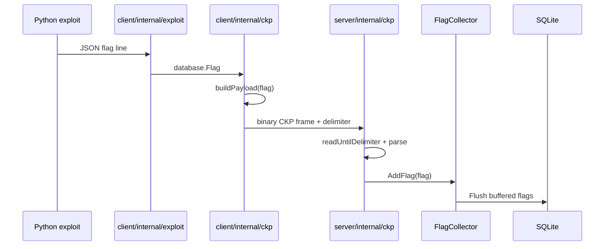

# CookieFarm CKP Protocol

This document covers only the CookieFarm CKP protocol implemented by `cookiefarm/server/internal/ckp` and `cookiefarm/client/internal/ckp`.

## 1. Purpose

CKP is CookieFarm's default low-overhead flag transport between `ckc` clients and the `cks` server. It replaces the older WebSocket flag stream with a persistent raw TCP connection and a compact binary frame format.

## 2. Transport

| Field | Value |
| --- | --- |
| Protocol | TCP |
| Server listen port | `7777` |
| Server package | `cookiefarm/server/internal/ckp` |
| Client package | `cookiefarm/client/internal/ckp` |
| Default client target | `<configured host>:7777` |
| Delimiter | `0xBB 0x54 0xCC` |
| Server max frame size | `1024` bytes before delimiter |

The client creates a `net.TCPConn`, enables `TCP_NODELAY`, enables keepalive, sets 64 KiB read/write buffers, and sends one CKP frame per captured flag.

## 3. Client-to-Server Flag Frame

Each flag frame is binary and little-endian:

```text
4 bytes  submit_time   uint32 little-endian
2 bytes  port_service  uint16 little-endian
2 bytes  team_id       uint16 little-endian
N bytes  flag_code     null-terminated string
M bytes  exploit_name  null-terminated string, basename only
3 bytes  delimiter     0xBB 0x54 0xCC
```

The delimiter is not part of the parsed payload. It is used by the server to split the TCP byte stream into frames.

## 4. Server Parsing

`server/internal/ckp.handler` reads from each TCP connection with a buffered reader and calls `readUntilDelimiter(reader, DelimiterBytes, 1024)`.

`parse(data)` then maps the payload into `database.Flag`:

| CKP field | `database.Flag` field |
| --- | --- |
| `submit_time` | `SubmitTime` |
| `port_service` | `PortService` |
| `team_id` | `TeamID` |
| `flag_code` | `FlagCode` |
| `exploit_name` | `ExploitName` |
| `port_service` via config | `ServiceName` |
| generated message | `Msg` |

`ServiceName` is resolved with `server/pkg/config.ConfigManager.MapPortToService(port)`.

The generated message is:

```text
Flag found for team: <team_id>
```

After parsing, the server calls `database.GetCollector().AddFlag(flag)`.

## 5. Server-to-Client Config Frame

CKP is bidirectional for configuration updates. When `POST /api/v1/config` succeeds, the server marshals the shared config as JSON and writes it to every connected CKP client with a trailing newline:

```text
{"services":{...},"regex_flag":"...","format_ip_teams":"..."}\n
```

The client read pump calls `ReadBytes('\n')`, unmarshals the payload into `sharedconfig.Shared`, updates `client/pkg/config`, and invokes `OnNewConfig` when registered.

The exploit command registers `OnNewConfig` to stop and restart the current exploit process so it picks up the new shared configuration.

## 6. Connection Lifecycle

### Server

- `StartServer(7777)` creates the CKP server.
- The listener uses TCP4 unless the listen address is IPv6.
- `SO_REUSEPORT` is enabled by default.
- The server starts multiple accept loops based on `GOMAXPROCS`.
- Accepted connections are processed through `server/pkg/pool.WorkerPool`.
- Active connections are stored in `Connections` so config updates can be broadcast.
- When a connection handler exits, the connection is removed from the registry and the connection struct is returned to a pool.

### Client

- `Start(flagsChan)` connects to `<host>:7777`.
- A read pump runs in the background to receive newline-delimited config JSON.
- The foreground loop reads flags from `flagsChan`, builds CKP payloads, and calls `SendWithRetry`.
- `SendWithRetry` attempts up to `3` sends.
- On send failure, the client reconnects and retries with incremental backoff.

## 7. Data Flow



## 8. Error Handling

- Oversized server frames return `message too large` and close the current read loop.
- Missing null terminators return parse errors and the server continues reading the connection.
- Invalid payloads shorter than 8 bytes are rejected.
- Client write failures trigger reconnect and retry.
- Config JSON unmarshal failures are returned from `handleConfig`; current client code logs only successful reads, so malformed config payloads should be prevented server-side.

## 9. Security Notes

- CKP does not encrypt traffic.
- CKP frames are not individually authenticated.
- CKP should run on a trusted competition network, a private VPN, or behind network ACLs.
- The REST API still enforces JWT authentication, but CKP flag ingestion itself is network-trust based.

## 10. Compatibility Notes

- The timestamp is serialized as `uint32`; values outside that range are truncated client-side.
- `team_id` is serialized as `uint16`; values outside that range are truncated client-side.
- The full frame must fit within the server's 1024-byte payload limit before the delimiter.
- `exploit_name` is reduced to `filepath.Base(flag.ExploitName)` before transmission.
