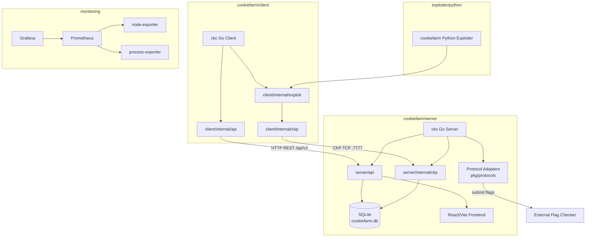
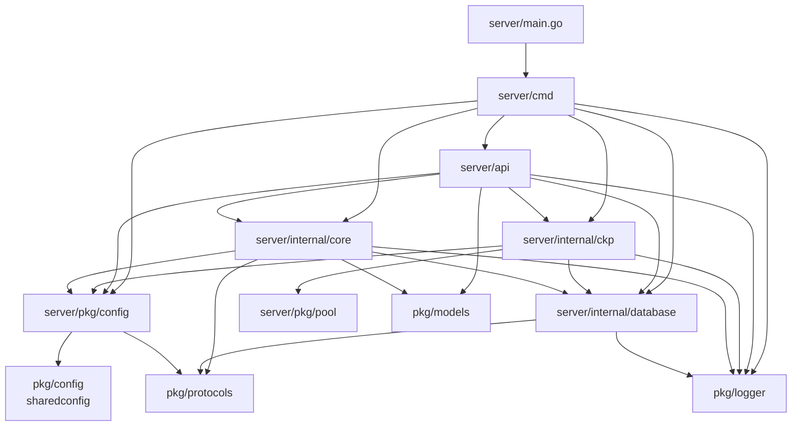
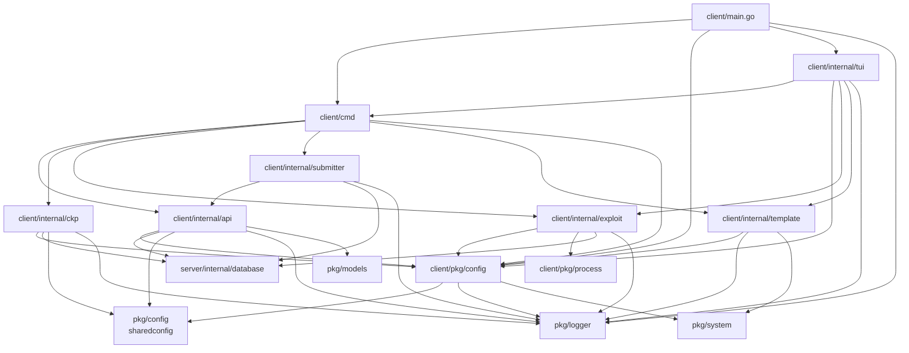
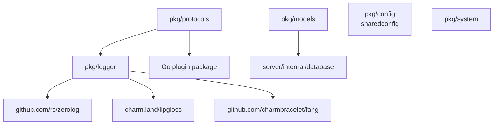
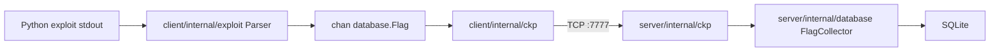
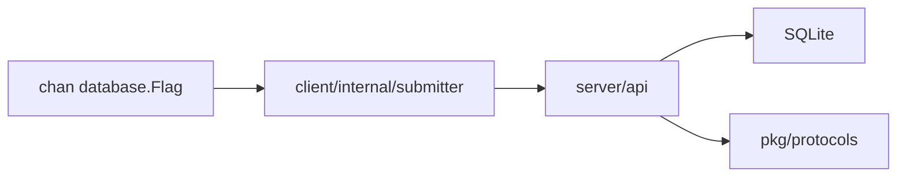

# CookieFarm - Dependency Graph

CookieFarm is a monorepo composed of a Go server, a Go client, shared Go packages, a Python exploiter library, a React/Vite server frontend, and a monitoring stack.

## 1. Top-Level Component Architecture

## 2. Server Package Dependencies

- `server/main.go` imports `server/cmd`.
- `server/cmd` wires configuration, database, core runner, CKP server, and Fiber API startup.
- `server/api` owns HTTP routing, auth middleware, Swagger routes, frontend fallback, and config broadcasts to connected CKP clients.
- `server/internal/ckp` owns the raw TCP listener, accepted connection registry, frame parsing, and config writes.
- `server/internal/core` owns the flag checker submission loop and TTL cleanup loop.
- `server/internal/database` owns SQLite schema access, sqlc generated queries, mapping helpers, and `FlagCollector`.
- `server/pkg/config` owns server runtime configuration, environment variables, JWT secret, and active checker submit function.
- `server/pkg/pool` is used by the CKP server worker pool.

## 3. Client Package Dependencies

- `client/main.go` initializes config and delegates to the TUI or Cobra command tree.
- `client/cmd` owns CLI commands and chooses CKP transport by default for exploit runs.
- `client/internal/ckp` depends on config, shared config, logger, and `server/database.Flag` for the binary flag payload model.
- `client/internal/api` wraps HTTP calls for auth, config, direct submission, and exploit upload.
- `client/internal/exploit` starts Python subprocesses, parses stdout, and emits flag channels.
- `client/internal/submitter` provides the HTTP fallback path used by `--submit`.
- `client/internal/template` manages generated exploit templates.
- `client/internal/tui` bridges Bubble Tea UI actions to command/package operations.
- `client/pkg/config` is the atomic runtime config singleton.
- `client/pkg/process` is a leaf package for cross-platform process management.

## 4. Shared Package Dependencies

- `pkg/config` defines the shared CTF metadata model imported as `sharedconfig`.
- `pkg/logger` wraps zerolog and Charm tooling for logs and CLI presentation.
- `pkg/models` defines status constants and HTTP request envelopes.
- `pkg/protocols` defines checker response types, built-in protocols, and dynamic protocol loading.
- `pkg/system` provides filesystem helpers such as tilde expansion.

## 5. CKP Dependency Position

CKP sits between the exploit parser and the server collector:

The HTTP submitter remains available but is not the default exploit-run path:

