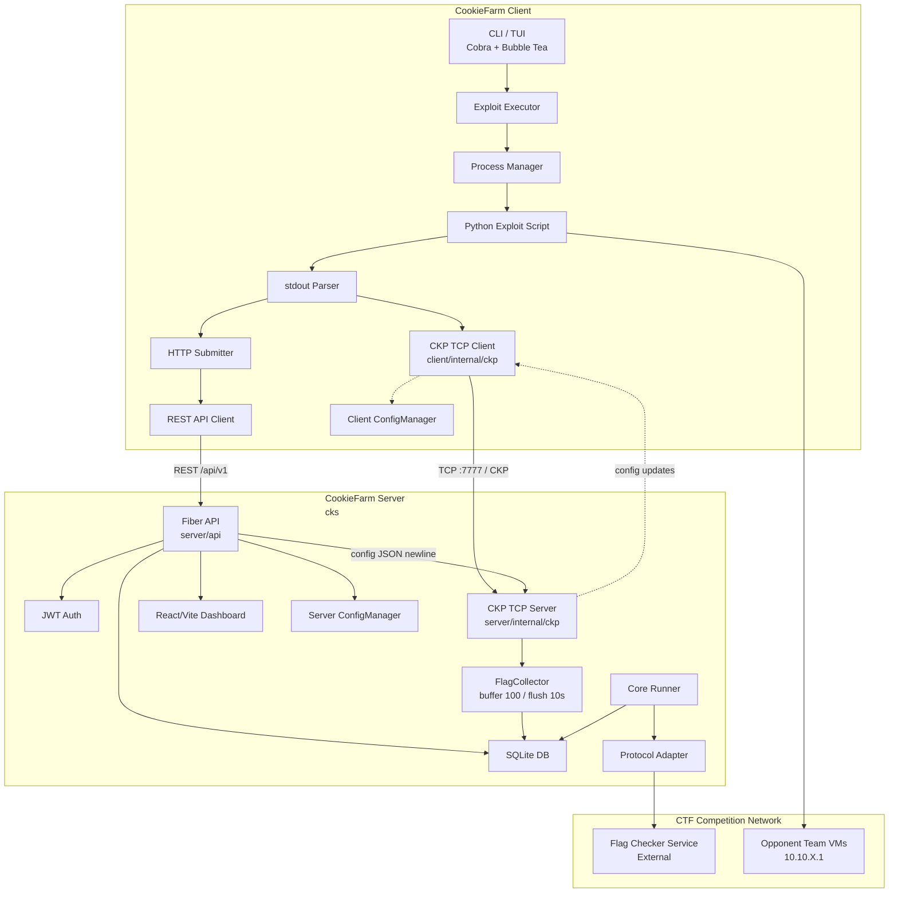
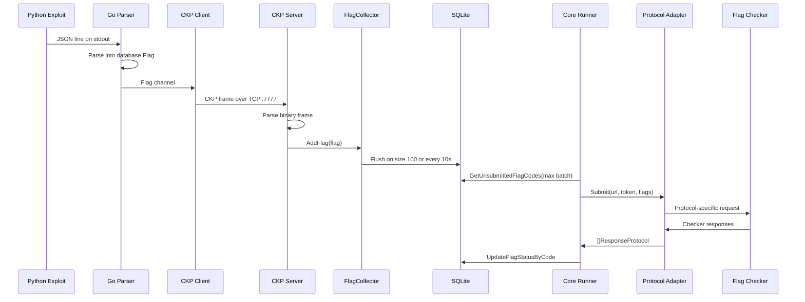

# System Understanding Document - CookieFarm

**Purpose:** This document outlines the architecture, components, interfaces, and data flows of the CookieFarm system. It is intended for developers, testers, and stakeholders working on the software lifecycle.

## 1. Overview

| Field | Value |
| --- | --- |
| System Name | CookieFarm |
| Prepared By | ByteTheCookies |
| Date | 2026 |
| Version | v2.0.0-rc |

CookieFarm is an Attack/Defense CTF framework inspired by DestructiveFarm, developed by ByteTheCookies.

## 2. System Objectives

CookieFarm automates the flag lifecycle in Attack/Defense CTF competitions:

- Distribute exploit execution across opponent teams.
- Capture flags produced by exploit scripts.
- Forward captured flags to the CookieFarm server through the CKP TCP protocol by default.
- Submit stored flags to the official flag checker through pluggable protocol adapters.
- Monitor flag status values in the web dashboard: `UNSUBMITTED`, `ACCEPTED`, `DENIED`, `ERROR`, and `NOT_VALID`.
- Let participants focus on writing exploits while CookieFarm handles execution, transport, storage, and checker submission.

## 3. Scope

**Server-side, Go:**

- Starts the `cks` server binary.
- Loads server and shared CTF configuration from `config.yml` or from the web API.
- Starts the Fiber v3 HTTP API and serves the React/Vite frontend.
- Starts the CKP TCP server on port `7777`.
- Receives flags from CKP clients and buffers them through the `FlagCollector`.
- Persists flags and uploaded exploit metadata into SQLite.
- Periodically submits batches of unsubmitted flag codes to the external flag checker.
- Deletes expired flags according to `flag_ttl` and `tick_time`.
- Exposes REST endpoints for authentication, configuration, flags, stats, protocols, exploits, and Swagger documentation.

**Client-side, Go + Python:**

- Provides the `ckc` CLI and Bubble Tea TUI.
- Stores local configuration under `~/.config/cookiefarm/`.
- Persists connection settings in `client.yml`, shared CTF metadata in `shared.yml`, and JWT session data in `session`.
- Launches Python exploit scripts as subprocesses through `client/pkg/process`.
- Parses exploit stdout JSON into `server/database.Flag` records.
- Forwards captured flags to the server through `client/internal/ckp` by default.
- Supports direct HTTP submission fallback through `client/internal/submitter` when `--submit` is used.
- Generates Python exploit templates using the `@exploit_manager` decorator from the CookieFarm Python library.

**Out of scope:**

- User-written exploit logic.
- The external CTF flag checker service.
- The CTF game infrastructure, scoring system, and team VMs.

## 4. Assumptions and Constraints

- Go `1.26.0+` is required by the Go workspace.
- Python 3 is required to execute exploit scripts.
- Docker can be used for server deployment.
- The server is designed for Linux production environments.
- Protocol plugins are loaded through Go's `plugin` package and must match the server Go runtime.
- The default password must be changed before production use.
- CKP uses raw TCP on port `7777`; this port must be reachable from clients.
- The REST API uses JWT authentication with cookies or `Authorization: Bearer`.
- Flag TTL is configured in ticks and evaluated using `flag_ttl * tick_time` seconds.
- The frontend under `cookiefarm/server/frontend` is a React/Vite dashboard.

## 5. System Architecture

CookieFarm is a distributed Go + Python system. The central server owns persistence, configuration, checker submission, authentication, and dashboard APIs. The client owns exploit lifecycle management and sends captured flags to the server.

The primary live flag transport is CKP, a compact custom TCP protocol. Direct HTTP submission remains available as a fallback and for manual single-flag submission.

### 5.1 Components

| Component | Description |
| --- | --- |
| `cookiefarm/server/main.go` | Server entrypoint. Delegates to `server/cmd`. |
| `cookiefarm/server/cmd` | Cobra root command. Initializes logging, config, SQLite store, core runner, CKP server, and Fiber app. |
| `cookiefarm/server/api` | Fiber v3 API layer. Registers public and private routes, CORS, JWT middleware, Swagger, frontend fallback, and config broadcasting to CKP clients. |
| `cookiefarm/server/internal/ckp` | CKP TCP server. Accepts persistent TCP clients, parses compact binary flag frames, and writes config JSON updates back to connected clients. |
| `cookiefarm/server/internal/core` | Background runner. Starts the checker submission loop and TTL cleanup loop. |
| `cookiefarm/server/internal/database` | SQLite persistence using generated sqlc queries. Includes the `FlagCollector` buffer with max size `100` and timer flush interval `10s`. |
| `cookiefarm/server/pkg/config` | Server `ConfigManager`, environment settings, full config model, JWT secret, and active checker `Submit` function. |
| `cookiefarm/server/pkg/pool` | Generic worker pool used by the CKP server to process accepted TCP connections. |
| `cookiefarm/client/main.go` | Client entrypoint. Initializes config and dispatches to TUI or CLI. |
| `cookiefarm/client/cmd` | Cobra command tree for config, login, exploit create/run/test/list/stop/remove/submit, and CKP startup. |
| `cookiefarm/client/internal/ckp` | CKP TCP client and payload encoder. Sends parsed flags to `host:7777`, retries failed sends, reconnects, and receives config updates. |
| `cookiefarm/client/internal/api` | HTTP client for login, config fetch, direct batch submission, single-flag submission, and exploit upload. |
| `cookiefarm/client/internal/exploit` | Exploit executor and parser. Runs Python scripts, parses JSON output, tracks running processes, and exposes flag/output channels. |
| `cookiefarm/client/internal/submitter` | HTTP fallback submitter. Sends batches to `/api/v1/submit-flags-standalone` or a single flag to `/api/v1/submit-flag`. |
| `cookiefarm/client/internal/template` | Creates and removes Python exploit templates in the local CookieFarm config directory. |
| `cookiefarm/client/internal/tui` | Bubble Tea TUI for configuration and exploit operations. |
| `cookiefarm/client/pkg/config` | Atomic client configuration manager for local/shared settings and session token. |
| `cookiefarm/client/pkg/process` | Cross-platform subprocess launcher with Unix process-group termination support. |
| `cookiefarm/pkg/config` | Shared CTF configuration model, imported as `sharedconfig`. |
| `cookiefarm/pkg/models` | Shared request and status models. |
| `cookiefarm/pkg/protocols` | Checker protocol adapters and dynamic plugin loading. Built-ins include `cc_http` and `faust`. |
| `cookiefarm/pkg/logger` | Shared logging and CLI theming helpers. |
| `cookiefarm/server/frontend` | React/Vite frontend served by the server. |

### 5.2 System Diagram

## 6. Data Design

Flags flow from Python exploit stdout to the Go parser, then to the server through CKP or HTTP. The server buffers incoming flags, writes them to SQLite, periodically reads unsubmitted flag codes, submits those codes to the flag checker through the selected protocol, and updates status fields from checker responses.

### 6.1 Data Entities

| Entity | Description |
| --- | --- |
| `database.Flag` | Primary flag record. Fields: `flag_code`, `service_name`, `port_service`, `submit_time`, `response_time`, `msg`, `status`, `team_id`, `username`, `exploit_name`. |
| `database.Exploit` | Uploaded exploit metadata: `id`, `name`, `hash`, `submit_time`, `username`, `version`. |
| `sharedconfig.Shared` | Shared CTF metadata: service map, flag regex, team IP format/range, own team ID, NOP team ID, flag IDs URL, and configured state. |
| `config.Config` | Server checker/runtime configuration: flag checker URL, team token, submit interval, max batch size, protocol, tick time, flag TTL, start time, and end time. |
| `config.FullConfig` | Server configuration envelope containing `Server`, `Shared`, and `Configured`. |
| `client/config.LocalConfig` | Client-local connection settings: host, port, username, HTTPS. |
| `models.SubmitFlagsRequest` | HTTP request body containing `[]database.Flag`. |
| `models.SubmitFlagRequest` | HTTP request body containing one `database.Flag`. |
| `protocols.ResponseProtocol` | Checker response per flag: status, flag code, and message. |
| `FlagCollector` | Server-side singleton buffer and stats object for received flags. |

### 6.2 Flag Capture and Submission Flow

### 6.3 Configuration Update Flow

1. An authenticated user posts a full config payload to `POST /api/v1/config`.
2. The server marks the full config and shared config as configured.
3. The server stores the new config in `server/pkg/config.ConfigManager`.
4. The core runner restarts submission processing with the updated settings.
5. The server marshals the shared config as JSON and writes it, newline-terminated, to every connected CKP client.
6. Each CKP client updates `client/pkg/config` and invokes `OnNewConfig`; the exploit command restarts the exploit process with the new configuration.

### 6.4 TTL Cleanup Flow

- `ValidateFlagTTL` ticks every `tick_time` seconds.
- On each tick it deletes flags older than `flag_ttl * tick_time` seconds using `DeleteFlagByTTL`.
- Expired flags are removed from SQLite, not resubmitted.

## 7. Interfaces

### 7.1 External Interfaces

| Name | Type | Description |
| --- | --- | --- |
| Flag Checker Service | Protocol adapter | Server submits flag codes through the selected protocol implementation. Built-ins include CyberChallenge-style HTTP and Faust. |
| Flag IDs Service | HTTP GET | Optional service used by exploit tooling for CyberChallenge-style flag IDs. Configured through `url_flag_ids`. |
| Opponent Team VMs | TCP or service-specific | Python exploits connect directly to team services using the configured IP pattern and ports. |
| Web Browser | HTTP/HTTPS | Users access the React/Vite dashboard and REST API through the server port. |
| CKP Clients | Raw TCP | Clients connect to server TCP port `7777` and send CKP frames. |

### 7.2 REST API Interfaces

| Endpoint | Auth | Description |
| --- | --- | --- |
| `GET /api/v1/` | Public | Health check. |
| `POST /api/v1/auth/login` | Public, rate-limited | Authenticates password and issues JWT cookie. |
| `POST /api/v1/auth/logout` | Public | Clears auth cookie. |
| `GET /api/v1/auth/verify` | Public | Verifies current auth state. |
| `GET /api/v1/protocols` | Public | Lists available checker protocol plugins. |
| `GET /api/v1/swagger` | Public | Serves Swagger UI. |
| `GET /api/v1/swagger/doc.json` | Public | Serves Swagger JSON. |
| `GET /api/v1/stats` | Private | Returns collector/database statistics. |
| `GET /api/v1/flags` | Private | Returns all flags ordered by submit time. |
| `GET /api/v1/flags/:limit?offset=N` | Private | Returns paginated flags. |
| `GET /api/v1/config` | Private | Returns shared config. |
| `GET /api/v1/config/full` | Private | Returns full server + shared config. |
| `POST /api/v1/config` | Private | Updates config and broadcasts shared config to CKP clients. |
| `POST /api/v1/submit-flags` | Private | Inserts a batch of flags for deferred checker submission. |
| `POST /api/v1/submit-flag` | Private | Inserts and immediately submits one flag. |
| `POST /api/v1/submit-flags-standalone` | Private | Inserts and immediately submits a batch of flags. |
| `DELETE /api/v1/delete-flag?flag=...` | Private | Deletes a flag by flag code. |
| `GET /api/v1/exploits` | Private | Lists uploaded exploits. |
| `GET /api/v1/exploit/:name` | Private | Retrieves one exploit. |
| `POST /api/v1/exploit/upload` | Private | Uploads exploit metadata/content. |
| `DELETE /api/v1/exploit/:id` | Private | Deletes an uploaded exploit. |

### 7.3 Internal Interfaces

| Interface | Description |
| --- | --- |
| `FlagCollector.AddFlag(flag)` | Adds one received flag to the in-memory server buffer. |
| `FlagCollector.FlushWithContext(ctx)` | Writes buffered flags to SQLite. |
| `Runner.StartFlagProcessingLoop(ctx)` | Periodically submits unsubmitted flags to the checker. |
| `Runner.ValidateFlagTTL(ctx, flagTTL, tickTime)` | Periodically deletes expired flags. |
| `protocols.LoadProtocol(name)` | Loads a checker protocol implementation. |
| `ckp.StartServer(7777)` | Starts the server-side CKP TCP listener. |
| `ckp.Start(flagsChan)` | Starts the client-side CKP submission loop. |

## 8. Security Considerations

- Password authentication is configured through the `PASSWORD` environment variable or server config path.
- Password verification uses bcrypt.
- JWT tokens are signed with HS256 using a random 32-byte server startup secret.
- JWT can be extracted from `Authorization: Bearer` or the `token` cookie.
- Private REST endpoints are protected by JWT middleware.
- Login is rate-limited.
- CKP is a raw TCP protocol and does not currently provide transport encryption or per-frame authentication. Deploy it only on trusted competition networks, through an encrypted tunnel, or behind network controls when needed.
- The default password must never be used in production.

## 9. Performance Requirements

Current implementation choices:

- CKP uses compact binary payloads to reduce per-flag overhead compared with JSON-over-WebSocket transport.
- TCP clients use `TCP_NODELAY`, keepalive, and 64 KiB read/write buffers.
- The CKP server uses multiple accept loops and a sharded worker pool.
- The flag collector batches writes with a max buffer size of `100` and a `10s` flush interval.
- Checker submission uses configurable batch size and interval.
- SQLite uses generated queries and indexed flag submit time.

Numeric SLOs are still to be defined by benchmark targets.

## 10. Important Notes

- Never push directly to `dev`.
- Never push directly to `main`.
- Test code before pushing.
- Keep branches up to date with `dev` before creating a PR.
- Delete feature branches after they are merged.
